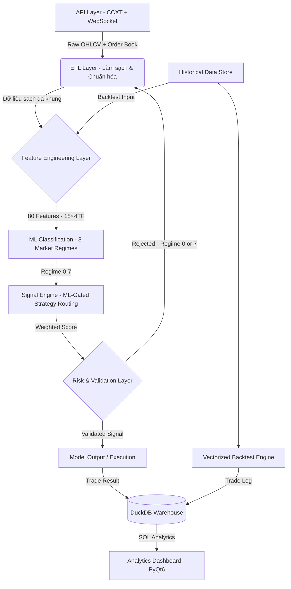

<div align="center">


# KAIROS QUANT SYSTEM
### End-to-End Data Analytics Pipeline for Financial Market Research

[](https://www.python.org/)
[](https://www.binance.com/)
[](https://opensource.org/licenses/MIT)
[](.)

**Stack:** `Python 3.12+` • `Pandas` • `Polars` • `PyTorch` • `DuckDB` • `PyQt6` • `CCXT`

</div>

<div align="left">

---

## Quick Start

Muốn chạy ngay lập tức? Thực hiện 3 bước:

```bash
# 1. Clone repository và cài đặt dependencies
git clone https://github.com/PVinh-Quant/Kairos-v2 && cd Kairos-v2 && pip install -r requirements.txt

# 2. Chạy chương trình chính
python main.py

# 3. Chọn chế độ (Demo, Backtest, Optimize, Dashboard)
```

Xem [Hướng dẫn cài đặt](#yêu-cầu--hướng-dẫn-cài-đặt) để hiểu chi tiết hơn.

---

## Core Capabilities

| Chức năng | Mô tả |
|---|---|
| **End-to-End ETL Pipeline** | Raw API → Clean Dataset. Thu thập OHLCV đa khung (1m–1d) từ 3 sàn (Binance/OKX/Bybit) qua CCXT + WebSocket. Chuẩn hóa timestamp, xử lý gaps & missing candles tự động. |
| **Multi-Timeframe Feature Engineering** | 68 indicators ✓ trên 8 khung thời gian (1m–1d). No look-ahead bias: `resample + shift index + forward-fill + live candle`. Mỗi bar chỉ nhìn thấy dữ liệu đã xảy ra. |
| **Vectorized Processing** | 100x+ tốc độ vs loop. Xử lý hàng triệu dòng trong vài phút (Polars/Pandas). |
| **ML Pipeline (PyTorch)** | Auto-labeling → 80-dim feature extraction → ResBlock MLP → walk-forward validation. Cùng `calc_core_features()` cho train & inference (no train-serve skew). |
| **DuckDB Data Warehouse** | Mỗi backtest ghi vào warehouse với `run_id` riêng. SQL queries: winrate/PnL/drawdown theo giờ/ngày/regime. |
| **Statistical Backtesting** | Walk-forward split + look-ahead prevention (data & execution). Signal bar N → entry bar N+1. |
| **Hyperparameter Optimizer** | Input: indicator + khung + trials. Output: tham số tối ưu + DSR/Sharpe/Sortino + IS/OOS reports. Hàng nghìn trials/phút. |
| **Indicator Live Workbench** | Thử nghiệm interactive: chỉnh tham số → backtest vectorized → xem signal/entry overlay real-time trên chart. |
| **Analytics Dashboard (PyQt6)** | Equity curve, drawdown, daily PnL calendar, session heatmap (win% by hour×day), trade scatter plots. |

-----

### Minh họa Analytics Dashboard


-----

## Key Results & Achievements

| Thành tựu | Chi tiết |
|-----------|---------|
| Xử lý dữ liệu khổng lồ | Pipeline xử lý hàng triệu dòng lịch sử (nhiều năm, nhiều cặp tài sản) song song mà không vấp phải tăng trưởng bộ nhớ |
| Tốc độ tính toán | Vectorization giảm thời gian từ hàng giờ xuống vài phút cho cùng khối lượng dữ liệu |
| Không bị look-ahead bias | Multi-timeframe features được thiết kế kỹ lưỡng để tránh rò rỉ dữ liệu; mô phỏng thực tế so với realtime |
| Data warehouse tích hợp | Mỗi lần chạy backtest được lưu vào DuckDB với run_id riêng, cho phép truy vấn phân tích cross-run (winrate, PnL, drawdown theo giờ/ngày/regime) |
| Kiểm định thống kê | Walk-Forward validation kết hợp Deflated Sharpe Ratio và OOS/IS ratio là hàng rào trước khi deploy |
| Tự động hoàn toàn | Toàn bộ quy trình từ nạp dữ liệu, làm sạch, trích chọn đặc trưng, phân tích, lưu trữ đến trực quan hóa đều được tự động hóa |

## Table of Contents

1. [Tầm nhìn & Phương pháp luận](#tầm-nhìn--phương-pháp-luận) — Triết lý hệ thống, bài toán cốt lõi
2. [Tổng quan hệ thống](#tổng-quan-hệ-thống) — 8 chế độ vận hành, kiến trúc
3. [Kỹ năng & Công nghệ](#kỹ-năng--công-nghệ-cốt-lõi) — Data engineering, ML, visualization
4. [Pipeline Dữ liệu](#kiến-trúc-pipeline-dữ-liệu) — ETL, OHLCV, multi-timeframe
5. [Feature Engineering & Scoring](#feature-engineering--hệ-thống-chấm-điểm-tín-hiệu) — 68 indicators, 8 timeframes
6. [ML Pipeline](#ml-pipeline-phân-loại-trạng-thái-thị-trường) — 8 market regimes, PyTorch
7. [Analytics & Optimizer](#analytics-dashboard-bộ-tối-ưu--indicator-live) — Dashboard, backtest, walk-forward
8. [SQL Warehouse](#sql-analytics--data-warehouse) — DuckDB, cross-run analysis
9. [Risk Management](#quản-trị-rủi-ro--kiểm-soát-chất-lượng-mô-hình) — Guardrails, DSR validation
10. [Cấu trúc thư mục](#cấu-trúc-thư-mục) — Project layout
11. [Cài đặt & Setup](#yêu-cầu--hướng-dẫn-cài-đặt) — Requirements, dependencies
12. [Khởi chạy & Cấu hình](#hướng-dẫn-cấu-hình--khởi-chạy) — CLI modes, config
13. [Lộ trình phát triển](#lộ-trình-phát-triển) — Roadmap
14. [Tutorial: Chiến lược từ đầu](#hướng-dẫn-nghiên-cứu-chiến-lược-từ-đầu) — Step-by-step guide
15. [Cảnh báo Rủi ro](#cảnh-báo-rủi-ro) — Disclaimer
16. [Chia sẻ của tác giả](#chia-sẻ-của-tác-giả) — Philosophy
17. [Tài liệu kỹ thuật](#tài-liệu-kỹ-thuật-chuyên-sâu) — Detailed technical docs

-----

<a name="1"></a>

<a name="1"></a>

## 1. TẦM NHÌN & PHƯƠNG PHÁP LUẬN

**KAIROS QUANT SYSTEM** — một hệ thống phân tích dữ liệu **end-to-end** cho nghiên cứu thị trường tài chính, nơi **mọi quyết định đều phải được kiểm chứng bằng dữ liệu**.

### Triết lý cốt lõi

> **"Dữ liệu là sự thật duy nhất. Mọi giả thuyết đều phải qua kiểm định thống kê."**

### Bài toán chính

| # | Bài toán | Giải pháp |
|---|----------|---------|
| 1 | **Dữ liệu từ nhiều nguồn** (REST, WebSocket, multiple exchanges) | ETL pipeline nhất quán, multi-source ingestion |
| 2 | **Raw price → tín hiệu có giá trị dự báo** mà không look-ahead bias | 68 indicators ✓ trên 8 timeframes, vectorized MTF |
| 3 | **Backtest không chính xác → chiến lược thất bại thực tế** | Walk-forward validation, bar-by-bar execution logic |
| 4 | **Phân loại regime + ra quyết định tự động** | 8 market states (PyTorch) + explainable routing |

### Data Science Lifecycle

| Giai đoạn | Công nghệ |
|-----------|----------|
| Ingest | REST API (CCXT) + WebSocket streams (Binance/OKX/Bybit) |
| Clean | Resampling multi-timeframe, fill NA, timestamp alignment |
| Feature | 68 indicators × 8 timeframes, vectorized Polars/Pandas |
| Validate | Walk-forward backtest, no look-ahead bias |
| Model | Classification: 8 regimes, ResBlock MLP (PyTorch) |
| Analyze | DuckDB SQL, cross-run profiling, interactive dashboard |

-----

<a name="2"></a>

## 2. TỔNG QUAN HỆ THỐNG

**KAIROS** — một **Data Analytics Pipeline hoàn chỉnh**, bao phủ toàn bộ vòng đời: **Ingest → Clean → Feature → Analyze → Model → Visualize**

### Kiến trúc Design Philosophy

Hệ thống tuân theo nguyên tắc:
> **"Mỗi `def` là một module độc lập"** — function nhận input rõ ràng, output xác định, zero external state dependency.

Điều này cho phép từng bước pipeline **chạy độc lập → kiểm tra riêng → tái sử dụng tự do**.

### 8 Operating Modes

Chạy `python main.py` để mở CLI menu:

| Mode | Chế độ | Mô tả | Đối tượng |
|------|--------|-------|----------|
| **1** | **Realtime Trading** | Kết nối sàn thật, thực thi lệnh qua CCXT | Live traders |
| **2** | **Demo / Paper** | Full pipeline, không đặt lệnh thực | Backtesting & learning |
| **3** | **Backtest (1-thread)** | Bar-to-bar simulation (1 CPU) | Single symbol testing |
| **4** | **Backtest (Multi-thread)** | Bar-to-bar parallel (N CPUs) | Multi-symbol batching |
| **5** | **Vectorized Backtest** | Matrix ops trên toàn dataset (~100x faster) | Large-scale research |
| **6** | **ML Training** | Auto-label → train → validate → deploy (8 regimes) | Regime classification |
| **7** | **Dashboard (PyQt6)** | Multi-tab app: Analytics + Optimizer + Indicator Live | Interactive exploration |
| **8** | **Hyperparameter Opt** | Walk-Forward + DSR guardrails (CLI version) | Parameter tuning |

> **Note:** Tabs "Optimizer" & "Indicator Live" tương tác được gói trong Dashboard [7]; CLI mode [8] dùng cho batch optimization.

-----

<a name="3"></a>

## 3. KỸ NĂNG & CÔNG NGHỆ CỐT LÕI

### Data Engineering & Pipeline

| Kỹ năng | Ứng dụng trong dự án |
|---|---|
| **ETL Design** | Thu thập → validate → transform → store dữ liệu OHLCV từ 3 sàn |
| **Time-Series Processing** | Resampling đa khung, timestamp alignment, fill NA strategy |
| **Data Quality** | Phát hiện gaps, outliers, corrupt candles; look-ahead bias prevention |
| **Performance Optimization** | Vectorization với Polars/Pandas: 100x+ so với loop-based approach |
| **Streaming Data** | WebSocket pipeline: CVD, order book depth, funding rate, liquidation |

### Feature Engineering — 48 chỉ báo trên 8 khung thời gian

| Nhóm | Chỉ báo | Số lượng |
| --- | --- | :---: |
| **Trend** | EMA, SMA, ADX, Ichimoku, SuperTrend, MACD, Parabolic SAR, Aroon, Vortex | 9 |
| **Momentum** | RSI, Stochastic %K/%D, CCI, Williams %R, ROC, MFI, Awesome Oscillator, TSI, Ultimate Oscillator | 9 |
| **Volatility** | ATR, Bollinger Bands + Squeeze, Keltner Channel, Donchian Channel, Historical Volatility, Chaikin Volatility, ATR Bands | 7 |
| **Volume** | Volume MA, Volume MA Dual, OBV, VWAP, Volume Profile (POC/VAH/VAL), CMF, A/D Line, MFI Volume, Ease of Movement | 9 |
| **Price Structure** | Breakout, ZigZag, Fractals, Pivot Points, FVG, Heikin Ashi, Market Structure (BOS/CHoCH), Order Blocks, Support/Resistance | 9 |
| **Market Sentiment** | CVD, Funding Rate, Order Book Imbalance, Liquidation Data | 4 |
| **Session & Cycle** | Asian / London / New York session, Session Range H/L | 2 |

>  *Chi tiết từng chỉ báo (Vectorized vs Bar-to-bar, công thức, mô tả) → xem [Engine Chỉ Báo](tai_lieu_chi_tiet.md#indicator) trong tài liệu kỹ thuật.*
>
>  *Bộ chỉ báo trên là **bản công khai** (`Indicator/`). Hai bản nâng cao `Indicator_mid` và `Indicator_high` (tối ưu hiệu năng & độ sâu tín hiệu) được **đóng mã nguồn** — xem [Phiên bản mã nguồn (Editions)](tai_lieu_chi_tiet.md#edition).*

### Machine Learning & SQL Analytics

* **Classification Task:** Phân loại thị trường thành **8 trạng thái** (regime 0-7) → routing đến chiến lược phù hợp
* **Architecture:** PyTorch MLP với ResBlock + BatchNorm + Dropout (chống overfitting)
* **Feature Pipeline:** 18 features × 4 timeframes (5M/15M/1H/4H) + 8 features memory context = **80 features** — Polars-based, không look-ahead bias
* **SQL Analytics:** DuckDB embedded warehouse — lưu kết quả từ 5 chế độ vận hành, truy vấn cross-run analysis

### Visualization & Analytics

* **Dashboard:** PyQt6 interactive — equity curve, drawdown, trade scatter, session heatmap
* **Charting:** Candlestick + multi-indicator overlay, entry/exit markers
* **Reporting:** Daily PnL, win rate by hour/day, hold duration distribution

-----

<a name="4"></a>

## 4. KIẾN TRÚC PIPELINE DỮ LIỆU

Hệ thống được phân tách rõ ràng thành các tầng độc lập (Separation of Concerns), dễ test và mở rộng từng module.



**Tầng 1 — Data Acquisition (`/lay_du_lieu`):** ETL layer kết nối REST API + WebSocket để kéo dữ liệu OHLCV đa khung, snapshot order book, và macro data (OI, Fear & Greed Index).

**Tầng 2 — Feature Engineering (`/chien_luoc/phan_tich_ky_thuat`):** Hai nhóm tính toán song song: *Signal features* (48 chỉ báo kỹ thuật trên 8 timeframe) và *ML features* (18 chỉ báo × 4 timeframe = 80 dimensions).

**Tầng 3 — ML Core (`/ml`):** Phân loại thị trường thành 8 regime (0-7). Regime 0 và 7 bị lọc khỏi giao dịch. Regime 1-6 route sang chiến lược phù hợp.

**Tầng 4 — Signal Engine (`/chien_luoc`):** ML regime gating quyết định chiến lược nào được kích hoạt. 5 chiến lược (Breakout, Squeeze, Trend Following, Mean Reversion, Scalping) chấm điểm độc lập, kết quả được chọn theo regime hiện tại.

**Tầng 5 — Data Warehouse (`/utils/kho_du_lieu.py`):** Toàn bộ kết quả được lưu vào DuckDB với `run_id` riêng. Truy vấn SQL phân tích cross-run, cross-mode.

**Tầng 6 — Analytics Layer (`/hien_thi`):** Dashboard PyQt6 trực quan hóa kết quả: equity curve, drawdown, trade analysis, session heatmap.

>  *Chi tiết từng module trong mỗi tầng → xem [Tài liệu kỹ thuật chi tiết](tai_lieu_chi_tiet.md).*

-----

<a name="5"></a>

## 5. FEATURE ENGINEERING & HỆ THỐNG CHẤM ĐIỂM TÍN HIỆU

### Multi-Timeframe Data Pipeline — Tóm tắt Nguyên Lý

Thách thức cốt lõi của vectorized backtest đa khung là **time-alignment**: ở mỗi bar 1m, indicator HTF phải phản ánh chính xác những gì bot có thể biết tại thời điểm đó. Hệ thống dùng một nguồn dữ liệu duy nhất là raw 1m OHLCV, sau đó dẫn xuất toàn bộ 8 khung từ đó.

**Quy trình 4 bước chống look-ahead bias trong mỗi hàm tính chỉ báo:**
1. **Resample** — Dựng nến đóng HTF từ dữ liệu 1m
2. **Shift index** — Dữ liệu nến HTF đóng lúc T chỉ được nhìn thấy từ T+period (chống look-ahead)
3. **Forward-fill** — Mỗi bar 1m thấy giá trị cuối cùng của nến HTF đã được phép biết
4. **Live indicator** — Tính indicator kết hợp lịch sử đã lock + close 1m hiện tại

>  *Chi tiết sơ đồ pipeline, giải thích shift, ví dụ cụ thể Bollinger Bands 15m, và các lỗi look-ahead phổ biến → xem [Tầng dữ liệu & Indicator](tai_lieu_chi_tiet.md#du-lieu) trong tài liệu kỹ thuật.*

### Ensemble Scoring — Hệ thống chấm điểm có trọng số

Thay vì dùng một rule đơn lẻ, KAIROS kết hợp nhiều góc nhìn phân tích độc lập:

| Module | Chức năng phân tích | Trọng số điển hình |
|---|---|---|
| `xu_huong.py` | EMA alignment, ADX strength, trend structure | Cao (khung 1h) |
| `cau_truc_gia.py` | Breakout, Fractal, FVG, Support/Resistance | Cao (khung 4h) |
| `khoi_luong.py` | Volume surge, OBV, VWAP deviation | Trung bình |
| `dong_luong_dao_chieu.py` | RSI divergence, MACD, momentum exhaustion | Trung bình |
| `bien_dong.py` | ATR regime, Bollinger squeeze, Keltner | Thấp–Trung bình |
| `vi_the.py` | CVD, Funding Rate, Order Book Imbalance | Xác nhận |
| `chu_ky.py` | Session classification, funding hour filter | Lọc |

**Formula tổng hợp:**
```
Total Score = Σ (Feature_Score_i × Weight_i × Timeframe_Multiplier)
Signal = BUY  nếu Total Score ≥ Threshold
         SELL nếu Total Score ≤ -Threshold
         HOLD otherwise
```

Trọng số thay đổi theo ML regime — khi thị trường được phân loại là "Ranging", trọng số của Mean Reversion feature tăng, Trend feature giảm → mô hình tự thích nghi với điều kiện thị trường.

-----

<a name="6"></a>

## 6. ML PIPELINE: PHÂN LOẠI TRẠNG THÁI THỊ TRƯỜNG

### Bài toán Classification

**Input:** 80 features — 18 chỉ báo × 4 timeframe (5M / 15M / 1H / 4H) + 8 context
**Output:** 8 nhãn trạng thái thị trường (multi-class classification)

| Regime | Nhãn | Chiến lược được kích hoạt |
|---|---|---|
| 0 | `Đóng_Băng` | Không trade — thị trường chết |
| 1 | `Nén_Chặt` | Squeeze — chờ bùng nổ |
| 2 | `Đầu_Xu_Hướng` | Breakout — vào sớm theo hướng phá vỡ |
| 3 | `Xu_Hướng_Mạnh` | Trend Following — follow trend đa khung |
| 4 | `Cao_Trào` | Mean Reversion — đánh ngược khi kiệt sức |
| 5 | `Hồi_Quy` | Mean Reversion — về trung bình |
| 6 | `Nhiễu_Động` | Scalping — range trade biên độ hẹp |
| 7 | `Quét_Thanh_Khoản` | Không trade — rủi ro cao |

### Pipeline ML tóm tắt

```
Raw OHLCV (1m)
    ↓ Feature Extraction (Polars, tao_feature.py) → 80 dimensions
    ↓ Labeling (trading_teacher.py) → Labeled Dataset
    ↓ Training: TradingMLP (PyTorch ResBlock × 3, skip connections)
    ↓ Evaluation: confusion matrix, walk-forward validation
    ↓ Deployment: model_pytorch.pth + scaler_params.json
    ↓ Inference: bar-to-bar (~20-35ms) hoặc vectorized batch (~500ms)
```

>  *Chi tiết kiến trúc TradingMLP (layer dimensions, BatchNorm, Dropout), thuật toán Auto-labeling (TradingTeacher), reward mechanism và fine-tuning → xem [Học Máy & Phân Loại Trạng Thái](tai_lieu_chi_tiet.md#ml) trong tài liệu kỹ thuật.*

-----

<a name="7"></a>

## 7. ANALYTICS DASHBOARD, BỘ TỐI ƯU & INDICATOR LIVE

KAIROS tích hợp một ứng dụng Desktop (PyQt6) **hợp nhất đa-tab** — vừa là nơi phân tích kết quả, vừa là **xưởng nghiên cứu chiến lược**: từ giám sát live, tối ưu tham số tự động đến thử nghiệm chỉ báo tương tác. Mọi tab dùng chung một nguồn tín hiệu, nên những gì nhìn thấy ở đây nhất quán với backtest và live.

### 7.1 Backtest Analytics Dashboard

Phân tích hiệu suất sau khi chạy backtest — `hien_thi/dashboard_backtest.py`

* **Equity Curve & Drawdown Chart:** Đường cong vốn tích lũy + underwater chart, phân tích risk-adjusted performance theo thời gian.
* **Daily PnL Calendar:** Lợi nhuận theo từng ngày dạng calendar view, click để drill-down từng lệnh trong ngày.
* **Session Heatmap:** Ma trận nhiệt Win Rate theo Giờ × Ngày trong tuần — trả lời "lúc nào model hoạt động tốt nhất?".
* **Trade Scatter Plot:** Phân tán Hold Duration × PnL — phát hiện pattern "cắt lời sớm / gồng lỗ" từ data.


-----

### 7.2 Demo / Live Monitor

Theo dõi real-time khi chạy Demo hoặc Live — `hien_thi/dashboard_demo.py` / `hien_thi/dashboard_realtime.py`

* **Market Heatmap:** Màu đỏ/xanh theo tín hiệu của từng symbol trên 7 khung thời gian (1m → 1d).
* **Vị thế đang mở:** Symbol, chiều (Buy/Sell), giá vào, size, thời gian giữ lệnh.
* **Lịch sử lệnh:** PnL từng lệnh kèm lý do đóng — SL hit, TP hit, hay tín hiệu đảo chiều.
* **Equity real-time:** Cập nhật liên tục theo từng lệnh đóng.

-----

### 7.3 Vectorized Backtest UI — Nghiên cứu chiến lược

Visualize từng tín hiệu trực tiếp trên biểu đồ giá — `hien_thi/dashboard_vectorized.py`

* **Candlestick + entry/exit markers:** Tam giác xanh = điểm vào lệnh, X cam = điểm thoát.
* **Trade list panel:** Danh sách toàn bộ lệnh — click để highlight trên biểu đồ.
* **Multi-timeframe switcher:** Chuyển nhanh giữa 1m/3m/5m/15m/1h/4h/1d.

-----

### 7.4 Bộ Tối ưu hóa Tham số (Walk-Forward) — *Engine nâng cao*

Trả lời câu hỏi cốt lõi của mọi nhà nghiên cứu định lượng: *"Bộ tham số này cho edge bền vững, hay chỉ là một kết quả đẹp do thử quá nhiều lần?"* — Truy cập qua **CLI** (`python main.py → [8]`) hoặc **tab Tối ưu** trong app desktop với giao diện **kéo-thả** chỉ báo.

| Khía cạnh | Mô tả |
|---|---|
| **Đầu vào** | Một chỉ báo đơn (dò trên cả 7 khung), hoặc **tổ hợp nhiều chỉ báo đa khung thời gian** (logic AND); khoảng dữ liệu (symbols + ngày), số trials, chỉ số mục tiêu (Sharpe/Sortino…) |
| **Đầu ra** | **Bộ tham số + ngưỡng entry/exit tốt nhất** → lưu thành artifact JSON (`du_lieu/danh_sach_chien_luoc/`), chảy thẳng sang Backtest / Biểu đồ nến / Live · **Bảng xếp hạng** so sánh nhiều chỉ báo · **Báo cáo Walk-Forward** (In-Sample tối ưu vs Out-of-Sample kiểm tra mù) · biểu đồ equity/drawdown/PnL/scatter của bộ tốt nhất |
| **Chỉ số đánh giá** | **Deflated Sharpe Ratio** (chống false discovery khi thử nhiều lần), Sharpe/Sortino có kiểm soát độ tin cậy mẫu (tối thiểu **30 lệnh · 14 ngày**, kẹp giá trị để không bị thổi phồng) |
| **Hàng rào deploy** | Một chiến lược chỉ được coi là "đủ tin cậy" khi vượt **tất cả**: DSR ≥ 90% · OOS/IS ≥ 0.8 · OOS Trades ≥ 30 · Profit Factor ≥ 1.2 |
| **Hiệu năng** | Động cơ backtest **in-memory** tách riêng khỏi pipeline đồ họa/I/O — chạy **hàng nghìn trials** liên tục không nghẽn cổ chai; có thể **dừng giữa chừng** và vẫn giữ bộ kết quả tốt nhất |

> Bộ tối ưu được thiết kế như một *bộ lọc kỷ luật*: Walk-Forward và Deflated Sharpe tồn tại để chống lại thiên kiến tâm lý phổ biến nhất của người làm nghiên cứu — tin vào một con số chỉ vì nó đẹp. Đây là chỗ "trực giác" buộc phải nhường cho "bằng chứng thống kê".

>  *Bản công khai `toi_uu_hoa/` minh họa đầy đủ luồng dò tham số + Walk-Forward. Nguyên lý thuật toán, công thức Deflated Sharpe Ratio và bản production tối ưu hiệu năng được giữ ở bản đóng mã nguồn **`toi_uu_hoa_high`** (thương mại).*

-----

### 7.5 Indicator Live — Bàn thử nghiệm chỉ báo tương tác

Đối trọng "thủ công" của bộ tối ưu — tab **Chỉ báo thủ công** (`hien_thi/man_hinh/nen_thu_cong/`). Thay vì để máy dò, nhà nghiên cứu **tự nhập tay** tham số và ngưỡng cho từng chỉ báo, từng khung thời gian, rồi thấy ngay hệ quả trên biểu đồ.

* **Đầu vào:** Chọn nhiều chỉ báo + khung thời gian + logic kết hợp; nhập tay tham số & ngưỡng entry/exit.
* **Đầu ra:** Backtest vectorized chạy ngay → **biểu đồ nến + marker vào/ra lệnh + bảng lệnh chi tiết** (tái dùng engine biểu đồ của tab Biểu đồ nến).
* **Hiệu năng:** Vòng lặp *what-if* gần như tức thời — đổi tham số → chạy lại → nhìn kết quả, không phải chờ một phiên tối ưu đầy đủ.

> Mục đích: biến trực giác thành giả thuyết kiểm chứng được, trên cùng một bộ tín hiệu dùng chung với toàn hệ thống. Nơi nhà nghiên cứu "đối thoại" trực tiếp với dữ liệu trước khi giao cho máy tối ưu hàng loạt.

-----

<a name="8"></a>

## 8. SQL ANALYTICS & DATA WAREHOUSE

Sau mỗi lần chạy backtest, toàn bộ lịch sử lệnh được lưu tự động vào **DuckDB** — embedded analytical database chạy trực tiếp trên file, không cần server. Mỗi lần chạy có một `run_id` riêng để so sánh giữa các chiến lược và khoảng thời gian khác nhau.

Hệ thống ghi nhận kết quả từ **5 chế độ** (backtest_bar, backtest_da_luong, backtest_vector, demo, realtime) và cung cấp hơn **15 hàm truy vấn phân tích** sẵn có: winrate theo giờ/thứ/regime/chiến lược/session, Sharpe/Sortino ratio, Kelly criterion, Monte Carlo simulation, streak analysis, regime transition matrix, và ad-hoc SQL tùy ý.

### Ví dụ output — PnL theo ML regime

| regime | regime_name | so_lenh | winrate_pct | tong_pnl | tb_pnl |
| --- | --- | --- | --- | --- | --- |
| 3 | Xu_Hướng_Mạnh | 142 | 61.3 | +842.5 | +5.9 |
| 2 | Đầu_Xu_Hướng | 98 | 54.1 | +310.2 | +3.2 |
| 6 | Nhiễu_Động | 215 | 44.2 | -180.4 | -0.8 |
| 4 | Cao_Trào | 76 | 48.7 | -42.1 | -0.6 |

Từ bảng này có thể kết luận ngay: tắt scalping ở regime Nhiễu_Động (6) — thứ không ai thấy được nếu chỉ nhìn vào tổng winrate.

>  *Chi tiết SQL schema (backtest_run, lenh, signal_log), Views, danh sách đầy đủ các hàm truy vấn phân tích, và ví dụ sử dụng → xem [Lưu trữ & SQL](tai_lieu_chi_tiet.md#luu-tru) trong tài liệu kỹ thuật.*

-----

<a name="9"></a>

## 9. QUẢN TRỊ RỦI RO & KIỂM SOÁT CHẤT LƯỢNG MÔ HÌNH

* **Look-ahead Bias Prevention:** Mọi feature đều được tính trước thời điểm tín hiệu. Dữ liệu train/test được chia theo walk-forward (không random shuffle).
* **Overfitting Detection:** Drawdown limit tự động dừng mô hình khi performance thực tế lệch xa backtest.
* **Dynamic SL/TP (ATR %):** Stop-loss tính theo ATR, clamp trong biên an toàn (SL: 0.5%–15%, TP: 1%–30%).
* **Multi-factor Dynamic Leverage:** Đòn bẩy kết hợp 5 nhân tố: ATR, ADX, Volume surge, Breakout signal, Bollinger Squeeze. Kết quả được clamp trong `[1, max_leverage]`.
* **Robustness Testing:** Kiểm thử mô hình trên nhiều cặp tài sản, nhiều giai đoạn thị trường khác nhau (bull/bear/ranging).

>  *Chi tiết công thức SL/TP động, đòn bẩy đa nhân tố, và cơ chế bảo vệ vốn → xem [Chiến lược, thực thi lệnh & backtest](tai_lieu_chi_tiet.md#chien-luoc) trong tài liệu kỹ thuật.*

-----

<a name="10"></a>

## 10. CẤU TRÚC THƯ MỤC

```text
Kairos-v2/
├── main.py                              # Entry point – menu điều hướng các chế độ
├── requirements.txt
│
├── config/                              # CẤU HÌNH HỆ THỐNG
│   ├── cau_hinh_giao_dich.yaml          # Assets, khung thời gian, tham số rủi ro
│   ├── cau_hinh_ao_config.json          # Cấu hình môi trường simulation/backtest
│   ├── tai_khoan_api.json               # API credentials (gitignore)
│   ├── tai_khoan_api.json.example       # Template cấu hình API
│   └── thong_tin_san.yaml               # Exchange metadata (min lot, tick size)
│
├── lay_du_lieu/                         # ETL LAYER – Thu thập & Chuẩn hóa Dữ liệu
│   ├── lay_ohlcv.py                     # OHLCV lịch sử + đa khung thời gian (CCXT)
│   ├── lay_marketsnapshot.py            # WebSocket: CVD, order book, liquidation
│   ├── lay_macro.py                     # Macro data: OI, Fear & Greed Index
│   └── lay_thong_tin_tai_khoan.py       # Số dư, vị thế, lịch sử lệnh
│
├── Indicator/                           # FEATURE ENGINE – 48 chỉ báo (bản công khai/PoC)
│   ├── xu_huong.py · dong_luong_dao_chieu.py · bien_dong.py
│   ├── khoi_luong.py · cau_truc_gia.py · vi_the.py · chu_ky.py
│   └── Indicator_mid / Indicator_high     # Bản nâng cao – ĐÓNG MÃ NGUỒN
│
├── chien_luoc/                          # FEATURE ENGINEERING & SIGNAL LAYER
│   ├── logic_bar_to_bar/                # Engine thời gian thực (Polars, từng nến)
│   │   ├── phan_tich_ky_thuat/          # 7 module chỉ báo (48 indicators)
│   │   ├── chien_luoc/                  # 5 chiến lược (bar-to-bar scoring)
│   │   ├── quan_ly_chien_luoc.py        # Điều phối: ML regime → chiến lược
│   │   ├── chien_luoc_don_bay.py        # Đòn bẩy động đa nhân tố
│   │   └── stoploss_takeprofit.py       # SL/TP động (ATR-scaled)
│   │
│   └── logic_vectorized/                # Engine batch (Pandas, toàn bộ dataset)
│       ├── phan_tich_ky_thuat/          # Cùng 7 module, tính vectorized
│       ├── chien_luoc/                  # 5 chiến lược (vectorized scoring)
│       └── quan_ly_chien_luoc.py        # Tổng hợp tín hiệu + ML gating
│
├── ml/                                  # ML PIPELINE
│   ├── main.py                          # Orchestrator: train / evaluate / deploy
│   ├── tool/                            # Auto-labeling, data filter, regime visualizer
│   └── trang_thai_thi_truong_ml/        # Feature extraction, TradingMLP, inference
│
├── chuc_nang/                           # PIPELINE RUNNERS
│   ├── chay_realtime.py                 # Chạy bot thật (live trading)
│   ├── chay_demo.py                     # Forward test không rủi ro
│   ├── backtest_donluong.py             # Bar-to-bar backtest (1 luồng)
│   ├── backtest_daluong.py              # Bar-to-bar backtest (đa luồng)
│   └── vectorized_backtest.py           # Vectorized backtest toàn dataset
│
├── toi_uu_hoa/                          # OPTIMIZATION ENGINE (Walk-Forward)
│   ├── bo_dieu_phoi.py                  # Điều phối dò tham số + Walk-Forward (IS/OOS)
│   ├── dong_co_backtest.py             # Động cơ backtest in-memory (hàng nghìn trials)
│   ├── kiem_dinh.py                     # Hàng rào kiểm định: DSR, OOS/IS, Profit Factor
│   ├── dang_ky_chi_bao.py               # Registry không gian tham số mỗi chỉ báo
│   └── giao_dien_cli.py                 # CLI tương tác (Rich)
│
├── toi_uu_hoa_high/                    # Bản production của Optimizer – ĐÓNG MÃ NGUỒN
│
├── thuc_thi_lenh/                       # ORDER EXECUTION LAYER
│   ├── bo_may_thuc_thi.py               # Singleton quản lý kết nối sàn
│   ├── mo_lenh.py / dong_lenh.py        # Mở/đóng lệnh (market/limit)
│   ├── quan_ly_lenh.py                  # Quản lý trạng thái lệnh đang mở
│   └── ket_noi_san/                     # Binance, Bybit, OKX connectors
│
├── hien_thi/                            # DESKTOP APP – PyQt6 ĐA-TAB
│   ├── app/ung_dung.py                  # Vỏ app hợp nhất (registry-driven, 1 SSOT)
│   └── man_hinh/                        # Các tab/màn hình
│       ├── toi_uu/                      # Tab TỐI ƯU – builder kéo-thả + tối ưu tự động
│       ├── nen_thu_cong/               # Tab INDICATOR LIVE – nhập tay + chart trực tiếp
│       ├── bieu_do_nen/                # Biểu đồ nến + entry/exit markers
│       ├── backtest/                    # Equity curve, drawdown, PnL scatter, heatmap
│       └── realtime.py / demo.py        # Live monitoring / forward-test
│
├── thong_bao/                           # NOTIFICATIONS
│   ├── gui_email.py                     # Gửi báo cáo qua Email
│   └── gui_telegram.py                  # Cảnh báo real-time qua Telegram
│
├── utils/                               # UTILITIES
│   ├── ham_tien_ich.py                  # MTF data merge, Anti Look-Ahead
│   ├── kho_du_lieu.py                   # Data Warehouse (DuckDB): lưu & SQL analytics
│   └── log.py / doc_cau_hinh.py         # Logging, config parser
│
└── du_lieu/                             # DATA STORAGE
    ├── lich_su_gia/                     # Historical OHLCV (CSV)
    ├── kairos_warehouse.duckdb          # Data warehouse
    └── nhat_ky_hoat_dong.log            # Application log
```

-----

<a name="11"></a>

## 11. YÊU CẦU & HƯỚNG DẪN CÀI ĐẶT

```bash
# Clone và cài đặt dependencies
git clone <repo>
cd kairos-v2
pip install -r requirements.txt
```

**Thư viện chính:**

| Thư viện | Mục đích |
|---|---|
| `pandas`, `polars` | Data processing & feature engineering |
| `numpy` | Vectorized computations |
| `pytorch` | ML model training & inference |
| `scikit-learn`, `joblib` | ML preprocessing, metrics |
| `ta` | Technical analysis indicators (RSI, ATR, ADX...) |
| `ccxt` | Exchange API connector — Binance, OKX, Bybit |
| `pyqt6`, `pyqtgraph`, `matplotlib` | Analytics dashboard & charting |
| `websocket-client` | Streaming data pipeline |
| `duckdb` | Embedded SQL analytics — data warehouse |
| `rich` | Structured terminal logging |

-----

<a name="12"></a>

## 12. HƯỚNG DẪN CẤU HÌNH & KHỞI CHẠY

### 12.1 Cấu hình & Khởi chạy Menu chính

Sao chép template API keys và tùy chỉnh cấu hình giao dịch:
```bash
cp config/tai_khoan_api.json.example config/tai_khoan_api.json
# Sửa config/cau_hinh_giao_dich.yaml — chọn sàn, cặp tiền, đòn bẩy, phân bổ vốn
python main.py
```

Hệ thống sử dụng thư viện `rich` để xây dựng CLI Dashboard tương tác trực quan:

```text
 ┌────────────────────────────────────────────────────────────────────────────────────────┐
 │                     ██╗  ██╗ █████╗ ██╗██████╗  ██████╗ ███████╗                       │
 │                     ██║ ██╔╝██╔══██╗██║██╔══██╗██╔═══██╗██╔════╝                       │
 │                     █████╔╝ ███████║██║██████╔╝██║   ██║███████╗                       │
 │                     ██╔═██╗ ██╔══██║██║██╔══██╗██║   ██║╚════██║                       │
 │                     ██║  ██╗██║  ██║██║██║  ██║╚██████╔╝███████║                       │
 │                     ╚═╝  ╚═╝╚═╝  ╚═╝╚═╝╚═╝  ╚═╝ ╚═════╝ ╚══════╝                       │
 │                                  Analytics System v2                                   │
 ├──────────────────────────────────────────────┬─────────────────────────────────────────┤
 │  Menu                                        │  Config hiện tại                        │
 │  ──────────────────────────────────────────  │  ────────────────────────────────────── │
 │  LIVE TRADING                                │  Symbols:   BTC/USDT, ETH/USDT...       │
 │  [1] Giao dịch Realtime   (Thật · CCXT)      │  Đòn bẩy:   7x                          │
 │  [2] Demo / Paper Trading (Không rủi ro)     │  Backtest:  2024-01-01 → 2024-12-31     │
 │                                              │  Vốn:       10,000 USDT                 │
 │  BACKTESTING                                 ├─────────────────────────────────────────┤
 │  [3] Backtest Đơn luồng   (Bar-to-bar 1-CPU) │  Tác giả                                │
 │  [4] Backtest Đa luồng    (Song song đa-CPU) │  P. Vinh - Quant Research & Dev         │
 │  [5] Vectorized Backtest  (Ma trận 100x+)    │                                         │
 │                                              │  "Romain Rolland: 'There is only one    │
 │  AI / ML                                     │   heroism in the world: to see the      │
 │  [6] ML Training    (Huấn luyện & Deploy)    │   world as it is, and to love it.'"     │
 │                                              │  ────────────────────────────────────── │
 │  ANALYTICS                                   │  Kairos v2 · 2026                       │
 │  [7] Dashboard Analytics  (PyQt6 · đa-tab)   │─────────────────────────────────────────┘
 │                                              │
 │  OPTIMIZATION                                │
 │  [8] Tối ưu hóa Tham số   (Walk-Forward)     │
 │                                              │
 │  [0] Thoát                                   │
 └──────────────────────────────────────────────┘
```

> [!NOTE]
> Hệ thống áp dụng cơ chế **Lazy Import**: Chỉ nạp thư viện nặng (PyQt6, PyTorch, CCXT) khi chức năng tương ứng được chọn. Tốc độ khởi chạy menu CLI < 100ms.

-----

<a name="13"></a>

## 13. LỘ TRÌNH PHÁT TRIỂN

*Đây là đề xuất cá nhân của tác giả, không phải cam kết.*

Tác giả sẽ **hạn chế phát triển thêm Kairos v2** để tập trung vào **Kairos-v3**. Hướng đề xuất cuối cùng cho v2:

**Dùng dữ liệu phi OHLCV làm bộ lọc cho live trading** — kết nối funding rate, CVD, OI, liquidation (đã có sẵn module trong `/lay_du_lieu/`) vào pipeline ra quyết định. Không phải để tìm edge mới, mà để tránh vào lệnh đúng kỹ thuật nhưng sai thời điểm.

Thứ tự thực hiện: Ổn định chiến lược OHLCV trước → Hook dữ liệu phi OHLCV vào `chien_luoc_trang_thai_thi_truong.py` → Chỉ test trong Demo/Live (không backtest được).

-----

<a name="14"></a>

## 14. HƯỚNG DẪN NGHIÊN CỨU CHIẾN LƯỢC TỪ ĐẦU

Quy trình chuẩn để phát triển và kiểm định một ý tưởng giao dịch trong KAIROS:

```
Lấy dữ liệu lịch sử
        │
        ├──────────────────────────────────┐
        ▼                                  ▼
Nghiên cứu chiến lược             Nghiên cứu ML
(logic_vectorized)                (ml/trang_thai_thi_truong_ml)
        │                                  │
        └──────────────┬───────────────────┘
                       ▼
           Vectorized Backtest  ← Vòng lặp nhanh, nhiều lần
                       │
                       ▼
           Bar-to-bar Backtest  ← Kiểm chứng chi tiết
                       │
                       ▼
           Demo / Paper Trading ← Thị trường thật, không rủi ro
                       │
                       ▼
               Live Trading     ← Vốn thật, quy mô nhỏ trước
```

**6 giai đoạn tuần tự:**

1. **Lấy dữ liệu lịch sử** — Thu thập OHLCV nhiều năm, nhiều symbol. Kiểm tra không gap lớn, volume > 0.
2. **Nghiên cứu chiến lược** (song song 2a) — Thiết kế logic tín hiệu trong `logic_vectorized/chien_luoc/`. Bắt đầu một chiến lược đơn, không kết hợp ML.
3. **Nghiên cứu ML** (song song 2b) — Huấn luyện và đánh giá model phân loại regime qua `python main.py → [6] ML Training`.
4. **Vectorized Backtest** — Kiểm tra nhanh xem ý tưởng có edge. Ngưỡng tối thiểu: Profit Factor > 1.3 trên out-of-sample, Winrate > 45% với RR ≥ 2:1.
5. **Bar-to-bar Backtest** — Mô phỏng sát thực tế hơn (SL/TP chính xác, partial fill). So sánh kết quả vectorized vs bar-to-bar, dấu hiệu nguy hiểm nếu lệch > 30%.
6. **Demo → Live** — Chạy ít nhất 2–4 tuần Demo trước khi Live. Bắt đầu với 10–20% vốn dự kiến.

-----

<a name="15"></a>

## 15. CẢNH BÁO RỦI RO

**Về kết quả backtest:** Toàn bộ kết quả dựa trên dữ liệu lịch sử. Kết quả đó **không đảm bảo hiệu suất trong tương lai**. Thị trường thay đổi cấu trúc theo thời gian.

**Về giới hạn của hệ thống:** Backtest mô phỏng theo bar, không tick-by-tick. Slippage/fee ước lượng cố định. Dữ liệu orderflow chỉ khả dụng trong Demo/Live.

**Về ML regime detection:** Model phụ thuộc vào chất lượng nhãn và phân phối training data. Trong điều kiện chưa từng xuất hiện, model có thể phân loại sai.

**Về mục đích sử dụng:** Dự án phục vụ mục đích **nghiên cứu, học tập và thử nghiệm phương pháp luận phân tích định lượng**. Không phải khuyến nghị đầu tư.

-----

### Phiên bản mã nguồn (Editions)

Repository công khai này là **bản nền tảng (Proof-of-Concept)** — đủ để chạy toàn bộ pipeline end-to-end và minh họa phương pháp luận. Hai engine cốt lõi (*Indicator* và *Bộ Tối ưu*) còn có các phiên bản nâng cao **đóng mã nguồn (closed-source)**, dành cho cấp phép/thương mại:

| Engine | Bản công khai (PoC) | Bản đóng mã nguồn (Closed-source / Commercial) |
|---|---|---|
| **Indicator** (feature engine) | `Indicator/` | `Indicator_mid` · `Indicator_high` — bản nâng cao, tối ưu hiệu năng & độ sâu tín hiệu |
| **Optimizer** (Walk-Forward) | `toi_uu_hoa/` | `toi_uu_hoa_high` — bản production, đóng mã nguồn |

> Nguyên lý thuật toán, công thức nội bộ và các tối ưu nâng cao thuộc về các bản đóng mã nguồn ở trên. Liên hệ tác giả để biết chi tiết cấp phép.

-----

<a name="16"></a>

## 16. CHIA SẺ CỦA TÁC GIẢ

Tôi không bắt đầu dự án này vì muốn trở thành trader. Tôi bắt đầu vì thị trường tài chính là một trong số ít bài toán dữ liệu trả lời thẳng thắn: nếu code sai, backtest sẽ nói ngay. Nếu tư duy sai, thực tế sẽ không nể nang.

Kairos v2 xây hoàn toàn trên OHLCV. Sau một thời gian, tôi nhận ra giới hạn cốt lõi: OHLCV là thông tin công khai nhất thế giới, đã được phản ánh vào giá. Một pipeline dù tinh vi đến đâu, nếu chỉ nhìn vào nến giá, vẫn chỉ đang mô tả lại những gì đã xảy ra. Nhận ra điều này không làm tôi nản — nó làm tôi hiểu rõ hơn mình đang thực sự làm gì.

Nếu phải chọn hai thứ khó nhất, tôi sẽ nói **HTF và ML** — khó hơn mọi thứ khác cộng lại. HTF khó vì lỗi hoàn toàn im lặng — bạn có thể viết pipeline đa khung trông hoàn toàn đúng, ra kết quả đẹp, và không hề biết rằng indicator 4h đang nhìn thấy tương lai. Không có exception, không warning — chỉ có winrate ảo. Còn ML thì khó ở chỗ *thiết kế bài toán*: label được tạo ra như thế nào thì không circular? Feature engineering mà không lọt look-ahead vào training data? Và cái khó nhất: làm sao biết model đang *học* hay chỉ đang *nhớ*.

Bên cạnh những thứ khó, có vài quyết định thiết kế đáng làm đúng từ đầu: `calc_core_features()` dùng chung cho train và inference — sửa công thức một chỗ thì cả hai đường tự động nhất quán. Signal xuất hiện ở bar N nhưng lệnh vào tại `open` của bar N+1. Hai engine song song (`logic_bar_to_bar` và `logic_vectorized`) trở thành cross-validation nội tại: khi kết quả lệch nhau, thường chỉ ra sự khác biệt trong mô phỏng, không phải lỗi chiến lược.

Kairos v2 sẽ ở lại như nó đang là — trung thực về những gì nó làm được và không làm được. Bước tiếp theo là **Kairos-3**, nơi bài toán được đặt lại từ đầu với kiến trúc đa nguồn dữ liệu ngay từ core.

*Đôi khi con đường thẳng nhất đến nơi bạn muốn đến lại là con đường vòng qua chỗ bạn cần phải sai trước.*

-----

<a name="17"></a>

## 17. TÀI LIỆU KỸ THUẬT CHUYÊN SÂU

Mọi chi tiết triển khai, mô tả giải thuật, cấu trúc cơ sở dữ liệu và hướng dẫn vận hành chuyên sâu được tài liệu hóa đầy đủ tại:

 **[Hướng dẫn kỹ thuật chi tiết — Technical Reference Manual](tai_lieu_chi_tiet.md)**

| Mục | Nội dung | Link |
|---|---|---|
| Cấu hình hệ thống | YAML, JSON, API keys, gitignore | [→ Chi tiết](tai_lieu_chi_tiet.md#cau-hinh) |
| Tầng thu thập dữ liệu | WebSocket streams, ETL, macro data | [→ Chi tiết](tai_lieu_chi_tiet.md#du-lieu) |
| Engine chiến lược & Chỉ báo | 48 chỉ báo, look-ahead prevention, MTF alignment | [→ Chi tiết](tai_lieu_chi_tiet.md#indicator) |
| Học máy & Phân loại regime | TradingMLP, Auto-labeling, feature pipeline 80D | [→ Chi tiết](tai_lieu_chi_tiet.md#ml) |
| Thực thi lệnh | Order Execution, Position Manager, Hedge Mode | [→ Chi tiết](tai_lieu_chi_tiet.md#chien-luoc) |
| Kịch bản vận hành | 5 luồng chạy backtest và live trading | [→ Chi tiết](tai_lieu_chi_tiet.md#tong-quan) |
| Dashboard PyQt6 | Biểu đồ phân tích, theme Pro Terminal | [→ Chi tiết](tai_lieu_chi_tiet.md#ui) |
| DuckDB Connector | Schema, SQL queries, cross-run analytics | [→ Chi tiết](tai_lieu_chi_tiet.md#luu-tru) |
| Lưu trữ dữ liệu | CSV, JSON, DuckDB warehouse | [→ Chi tiết](tai_lieu_chi_tiet.md#luu-tru) |
| Hệ thống cảnh báo | Telegram & Email notifications | [→ Chi tiết](tai_lieu_chi_tiet.md#mo-rong) |

-----

### THÔNG TIN TÁC GIẢ

* **Tác giả:** P Vinh
* **Vai trò:** Financial Data Analyst · ML Engineer · Quant Developer
* **Stack:** Python · Pandas · Polars · PyTorch · DuckDB · PyQt6 · CCXT
* **Phương pháp:** Data-driven design · Statistical validation · Human logic + AI-assisted development
* **Contact:** ppvinh1513@gmail.com

**Nếu Kairos v2 đã hỗ trợ được công việc nghiên cứu của bạn** và bạn muốn động viên mình tiếp tục phát triển dự án, mình rất cảm ơn một ly cà phê:

☕ **Buy Me a Coffee**: [https://me.momo.vn/pvinh05](https://me.momo.vn/pvinh05)

---

📈 **Liên kết giới thiệu đăng ký sàn giao dịch (Ủng hộ tác giả):**
* **Sàn Binance:** [Đăng ký tài khoản Binance](https://www.binance.com/register?ref=PVINH05QUAN) (Mã ref: `PVINH05QUAN`)
* **Sàn OKX:** [Đăng ký tài khoản OKX](https://okx.com/join/78316761) (Mã ref: `78316761`)
* **Sàn Bybit:** [Đăng ký tài khoản Bybit](https://www.bybitglobal.com/invite?ref=9DV1LD&medium=referral&utm_campaign=evergreen) (Mã ref: `9DV1LD`)

"Romain Rolland: 'There is only one heroism in the world: to see the world as it is, and to love it.'"*

</div>
