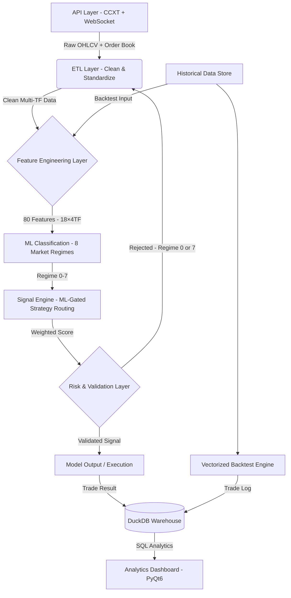

<div align="center">


# KAIROS QUANT SYSTEM
### End-to-End Data Analytics Pipeline for Financial Market Research

[](README.md) [](README_VI.md)

[](https://www.python.org/)
[](https://www.binance.com/)
[](https://opensource.org/licenses/MIT)
[](.)

**Stack:** `Python 3.12+` • `Pandas` • `Polars` • `PyTorch` • `DuckDB` • `PyQt6` • `CCXT`

</div>

<div align="left">

---

## Quick Start

Want to run it immediately? Follow these 3 steps:

```bash
# 1. Clone repository and install dependencies
git clone https://github.com/PVinh-Quant/Kairos-v2 && cd Kairos-v2 && pip install -r requirements.txt

# 2. Run the main program
python main.py

# 3. Select mode (Demo, Backtest, Optimize, Dashboard)
```

See [Installation & Setup](#11-requirements--installation) for more details.

---

## Core Capabilities

| Function | Description |
|---|---|
| **End-to-End ETL Pipeline** | Raw API → Clean Dataset. Multi-timeframe OHLCV (1m–1d) collection from 3 exchanges (Binance/OKX/Bybit) via CCXT + WebSocket. Auto-handles timestamp alignment, gaps & missing candles. |
| **Multi-Timeframe Feature Engineering** | 49 indicators ✓ across 8 timeframes (1m–1d). No look-ahead bias: `resample + shift index + forward-fill + live candle`. Each bar only sees historically available data. |
| **Vectorized Processing** | 100x+ speedup vs loops. Process millions of rows in minutes (Polars/Pandas). |
| **ML Pipeline (PyTorch)** | Auto-labeling → 80-dim feature extraction → ResBlock MLP → walk-forward validation. Identical `calc_core_features()` for train & inference (prevents train-serve skew). |
| **DuckDB Data Warehouse** | Every backtest execution is stored in the warehouse with a unique `run_id`. SQL queries: winrate/PnL/drawdown analytics grouped by hour/day/regime. |
| **Statistical Backtesting** | Walk-forward split + look-ahead prevention (data & execution layers). Signal on bar N → Entry on bar N+1. |
| **Hyperparameter Optimizer** | Inputs: indicator + timeframe + trials. Outputs: optimized parameters + DSR/Sharpe/Sortino + IS/OOS reports. Thousands of trials/minute. |
| **Indicator Live Workbench** | Interactive sandbox: change parameters → instant vectorized backtest → view signals/entry overlays real-time on charts. |
| **Analytics Dashboard (PyQt6)** | Equity curves, drawdowns, daily PnL calendar, session heatmaps (win% by hour×day), trade scatter plots. |

-----

### Analytics Dashboard Preview


-----

## Key Results & Achievements

| Achievement | Detail |
|-----------|---------|
| Big Data Processing | Parallel processing of millions of historical rows (multi-year, multi-asset) without memory leaks. |
| Computation Speed | Vectorization reduces calculation time from hours to minutes for the same data volume. |
| No Look-Ahead Bias | Carefully designed multi-timeframe feature alignment prevents data leaks, aligning backtesting closely with live trading. |
| Integrated Data Warehouse | Every backtest execution is stored in DuckDB, enabling multi-run cross queries (winrate, PnL, drawdown by hour/day/regime). |
| Statistical Validation | Walk-Forward validation combined with Deflated Sharpe Ratio (DSR) and OOS/IS ratio builds confidence before deployment. |
| Fully Automated | End-to-end automation from data ingestion, cleaning, feature engineering, modeling, storing, to PyQt6 visualization. |

## Table of Contents

1. [Vision & Methodology](#1-vision--methodology) — Core philosophy, key quantitative problems.
2. [System Overview](#2-system-overview) — 8 operating modes, modular architecture.
3. [Core Skills & Technologies](#3-core-skills--technologies) — Data engineering, ML, visualization.
4. [Data Ingestion & Ingress Pipeline](#4-data-ingestion--ingress-pipeline) — ETL, OHLCV resampler.
5. [Feature Engineering & Ensemble Scoring](#5-feature-engineering--ensemble-scoring) — 49 indicators, 8 timeframes.
6. [ML Pipeline: Regime Classification](#6-ml-pipeline-regime-classification) — 8 market regimes, PyTorch model.
7. [Analytics Dashboard, Optimizer & Indicator Live](#7-analytics-dashboard-optimizer--indicator-live) — PyQt6 apps, Walk-Forward.
8. [SQL Analytics & Data Warehouse](#8-sql-analytics--data-warehouse) — DuckDB embedded warehouse.
9. [Risk Management & Validation Guardrails](#9-risk-management--validation-guardrails) — Quality control, ATR stops, dynamic leverage.
10. [Directory Layout](#10-directory-layout) — Project structure.
11. [Requirements & Installation](#11-requirements--installation) — CLI steps and packages.
12. [Configuration & Running Guide](#12-configuration--running-guide) — CLI menu, configs.
13. [Roadmap](#13-roadmap) — Future development suggestions.
14. [Tutorial: Researching a Strategy from Scratch](#14-tutorial-researching-a-strategy-from-scratch) — Step-by-step quant workflow.
15. [Risk Disclaimer](#15-risk-disclaimer) — Performance warnings.
16. [Author's Note](#16-authors-note) — Development thoughts.
17. [Detailed Technical Reference Manual](#17-detailed-technical-reference-manual) — Deep dives.

-----

<a name="1"></a>

## 1. VISION & METHODOLOGY

**KAIROS QUANT SYSTEM** is an end-to-end data analytics pipeline built on a simple rule: **every trading hypothesis must pass strict statistical validation**.

### Core Philosophy

> **"Data is the only source of truth. Every assumption must be verified statistically."**

### Core Problems Addressed

| # | Challenge | KAIROS Solution |
|---|----------|---------|
| 1 | **Multi-source Data Ingestion** (REST, WebSockets, multiple exchanges) | Unified ETL pipeline, normalized multi-source ingestion. |
| 2 | **Raw price to predictive signals** without look-ahead leaks | 49 indicators calculated across 8 timeframes, vectorized MTF alignment. |
| 3 | **Backtest overfitting / live performance failure** | Walk-Forward validation, DSR guardrails, bar-by-bar execution. |
| 4 | **Regime classification & routing** | 8-class PyTorch market regime model + strategy routing. |

### Data Science Lifecycle

| Lifecycle Phase | Technology Stack |
|-----------|----------|
| Ingest | REST API (CCXT) + WebSocket streams (Binance/OKX/Bybit) |
| Clean | Multi-timeframe resampling, missing candle recovery, timezone normalization |
| Feature | 49 indicators × 8 timeframes, vectorized Polars/Pandas |
| Validate | Walk-Forward backtest, no look-ahead bias |
| Model | Classification: 8 market regimes, ResBlock MLP (PyTorch) |
| Analyze | DuckDB SQL backend, cross-run profiling, PyQt6 visualization |

-----

<a name="2"></a>

## 2. SYSTEM OVERVIEW

KAIROS separates concerns using a clear functional pipeline: **Ingest → Clean → Feature → Analyze → Model → Visualize**.

### Modular Design Philosophy

The codebase strictly adheres to:
> **"Every function is a self-contained module"** — functions receive clean inputs, return expected outputs, and maintain zero external state dependency.

This allows every pipeline stage to be tested, modified, and executed independently.

### 8 Operating Modes

Run `python main.py` to launch the interactive CLI dashboard:

| Mode | Operation | Description | Target Audience |
|------|-----------|-------------|-----------------|
| **1** | **Realtime Trading** | Live API integration, order execution via CCXT | Live Traders |
| **2** | **Demo / Paper** | Live pipeline processing without executing orders | Testing & Paper trading |
| **3** | **Backtest (1-thread)** | Bar-to-bar strategy simulation (1 CPU) | Single Symbol Research |
| **4** | **Backtest (Multi-thread)** | Bar-to-bar strategy simulation (N CPUs parallel) | Multi-symbol batch testing |
| **5** | **Vectorized Backtest** | High-speed matrix-based simulation (~100x faster) | Fast Strategy Screening |
| **6** | **ML Training** | Training & evaluating the PyTorch regime classifier | ML Engineers |
| **7** | **Dashboard (PyQt6)** | Multi-tab PyQt6 app (Analytics, Optimizer, Live Chart) | Interactive GUI Research |
| **8** | **Hyperparameter Opt** | Walk-Forward parameter optimizer (CLI batch version) | Batch Strategy Tuning |

> **Note:** The "Optimizer" & "Indicator Live" tabs are bundled within the Dashboard [7]; CLI mode [8] is used for batch optimization runs.

-----

<a name="3"></a>

## 3. CORE SKILLS & TECHNOLOGIES

### Data Engineering & Ingress Pipelines

* **ETL Architecture**: Pulls, validates, cleans, and stores market data across multiple exchanges.
* **Time-Series Alignment**: Vectorized resampling, timezone synchronization, and forward-filling strategy for missing candles.
* **Memory Management**: Polars integration ensures low-memory footprints during large-scale historical processing.
* **Stream Ingestion**: Websocket channels for real-time Orderbook, CVD, Funding rates, and liquidations.

### Feature Engineering — 49 Indicators on 8 Timeframes

| Category | Technical Indicators | Count |
| --- | --- | :---: |
| **Trend** | EMA, SMA, ADX, Ichimoku, SuperTrend, MACD, Parabolic SAR, Aroon, Vortex | 9 |
| **Momentum** | RSI, Stochastic %K/%D, CCI, Williams %R, ROC, MFI, Awesome Oscillator, TSI, Ultimate Oscillator | 9 |
| **Volatility** | ATR, Bollinger Bands + Squeeze, Keltner Channel, Donchian Channel, Historical Volatility, Chaikin Volatility, ATR Bands | 7 |
| **Volume** | Volume MA, Volume MA Dual, OBV, VWAP, Volume Profile (POC/VAH/VAL), CMF, A/D Line, MFI Volume, Ease of Movement | 9 |
| **Price Structure** | Breakout, ZigZag, Fractals, Pivot Points, FVG, Heikin Ashi, Market Structure (BOS/CHoCH), Order Blocks, Support/Resistance | 9 |
| **Market Sentiment** | CVD, Funding Rate, Order Book Imbalance, Liquidation Data | 4 |
| **Session & Cycle** | Asian / London / New York sessions, Session Range H/L | 2 |

> *Details on indicator parameters and logic can be found in the [Technical Indicator Reference](detailed_documentation.md#indicator-engine).*
> 
> *The indicators listed above belong to the open-source **Base edition** (`Indicator/`). The advanced editions `Indicator_mid` and `Indicator_high` (which optimize calculation speed and depth) are **closed-source** — see [Editions](detailed_documentation.md#editions-comparison).*

### Machine Learning & SQL Analytics

* **Classification Task**: Classifies the market into **8 states** (regime 0-7) → routes signals to appropriate strategies.
* **Architecture**: PyTorch MLP with ResBlock + BatchNorm + Dropout (to prevent overfitting).
* **Feature Pipeline**: 18 features × 4 timeframes (5M/15M/1H/4H) + 8 features memory context = **80 features** — Polars-based, no look-ahead bias.
* **SQL Analytics**: DuckDB embedded warehouse — stores results from all 5 operating modes, enabling cross-run queries.

### Visualization & Analytics

* **Dashboard**: PyQt6 interactive — equity curves, drawdowns, trade scatter plots, session heatmaps.
* **Charting**: Candlestick + multi-indicator overlay, entry/exit markers.
* **Reporting**: Daily PnL, win rate by hour/day, hold duration distribution.

-----

<a name="4"></a>

## 4. DATA INGESTION & INGRESS PIPELINE

The system enforces strict separation of concerns, dividing execution and storage into clean layers.



**Layer 1 — Data Acquisition (`/lay_du_lieu`)**: Ingests market data, order books, and macro indicators via REST and WebSocket.

**Layer 2 — Feature Engineering (`/chien_luoc/phan_tich_ky_thuat`)**: Computes signal indicators (49 indicators across 8 timeframes) and ML training vectors (80 dimensions) in parallel.

**Layer 3 — ML Core (`/ml`)**: Predicts the current market regime. Regimes 0 and 7 pause trading; regimes 1-6 adjust strategy weights.

**Layer 4 — Strategy Gating (`/chien_luoc`)**: Routes signals to 5 active models (Breakout, Squeeze, Trend, Mean Reversion, Scalping), weighting them based on the active ML regime.

**Layer 5 — Data Warehouse (`/utils/kho_du_lieu.py`)**: Stores results to DuckDB using unique `run_id` keys.

**Layer 6 — Visualization (`/hien_thi`)**: Draws equity curves, heatmaps, and candlesticks via PyQt6.

> *For detailed code paths and descriptions of each module in the layer, refer to the [Detailed Technical Reference Manual](detailed_documentation.md).*

-----

<a name="5"></a>

## 5. FEATURE ENGINEERING & ENSEMBLE SCORING

### Multi-Timeframe Data Pipeline — Principle Summary

The core challenge of multi-timeframe vectorized backtests is **time-alignment**: at each 1m bar, HTF indicators must reflect the exact information known at that timestamp. The system aggregates all 8 timeframes from raw 1m OHLCV.

**4-step process to prevent look-ahead bias in all indicator functions:**
1. **Resample** — Reconstruct HTF candles from 1m price lines.
2. **Shift index** — Assign calculated HTF values to the timestamp when the HTF candle *closes* + 1 period (eliminating look-ahead leaks).
3. **Forward-fill** — Lower timeframe (1m) rows read the last locked HTF value.
4. **Live indicator** — Calculates indicators by combining locked history and the current forming 1m close.

> *For pipeline flowcharts, shift index logic, concrete Bollinger Bands 15m examples, and common look-ahead errors, see [Data & Indicators](detailed_documentation.md#data-pipeline) in the Technical manual.*

### Ensemble Scoring — Weighted Scoring System

Rather than relying on a single rule, KAIROS combines indicators into a single score:

| Module | Analytical Focus | Baseline Weight |
|---|---|---|
| `xu_huong.py` | EMA configurations, ADX strength, structural trend | High (1h) |
| `cau_truc_gia.py` | Breakouts, Fair Value Gaps, Pivot points | High (4h) |
| `khoi_luong.py` | Volume surges, VWAP deviation, OBV delta | Medium |
| `dong_luong_dao_chieu.py` | RSI divergence, MACD momentum, Stoch extremes | Medium |
| `bien_dong.py` | ATR ranges, Bollinger squeezing, Keltner | Low-Medium |
| `vi_the.py` | CVD orderflow, order book imbalance | Validation |
| `chu_ky.py` | Session boundaries, funding fee window filters | Gating |

**Ensemble Formula:**
```text
Total Score = Σ (Feature_Score_i × Weight_i × Timeframe_Multiplier)
Signal = BUY  if Total Score ≥ Threshold
         SELL if Total Score ≤ -Threshold
         HOLD otherwise
```

Weights shift dynamically based on the ML regime — when classified as "Ranging", the weight of Mean Reversion features increases, and Trend features decrease, adapting the model to market conditions.

-----

<a name="6"></a>

## 6. ML PIPELINE: REGIME CLASSIFICATION

### Classification Task

**Input:** 80 features — 18 technical indicators × 4 timeframes (5M / 15M / 1H / 4H) + 8 memory state variables.
**Output:** 8 classification classes (Regimes 0-7) mapping the market state.

| Regime | Label | Active Strategies |
|---|---|---|
| 0 | `Frozen` | No trading (market flatline) |
| 1 | `Squeezing` | Compression (Squeeze model active) |
| 2 | `Early Trend` | Breakout (Volatility breakouts active) |
| 3 | `Strong Trend` | Trend Following (Trend models active) |
| 4 | `Climax` | Mean Reversion (Reversion from extremes active) |
| 5 | `Retracement` | Mean Reversion (Targeting VWAP/EMA active) |
| 6 | `Turbulent` | Scalping (Rangebound scalper active) |
| 7 | `Liquidation Sweep` | No trading (High risk/choppy spikes) |

### Training Workflow

```text
Raw OHLCV (1m)
    ↓ Feature Extraction (Polars, tao_feature.py) → 80 dimensions
    ↓ Labeling (trading_teacher.py) → Labeled Dataset
    ↓ Training: TradingMLP (PyTorch ResBlock × 3, skip connections)
    ↓ Evaluation: confusion matrix, walk-forward validation
    ↓ Deployment: model_pytorch.pth + scaler_params.json
    ↓ Inference: bar-to-bar (~20-35ms) or vectorized batch (~500ms)
```

> *For `TradingMLP` layers, hyperparameters, loss functions, and label generation, see [ML Section](detailed_documentation.md#ml-regime) of the technical reference.*

-----

<a name="7"></a>

## 7. ANALYTICS DASHBOARD, OPTIMIZER & INDICATOR LIVE

KAIROS integrates a desktop interface (PyQt6) that serves as a strategy research laboratory.

### 7.1 Backtest Analytics Dashboard

Located at `hien_thi/dashboard_backtest.py`:
* **Equity Curve & Drawdowns**: Plots equity curves alongside maximum drawdown charts.
* **Daily PnL Calendar**: Visualizes returns on a monthly calendar grid. Click to drill-down into specific trades.
* **Session Heatmap**: Plots win rates across Hour of Day × Day of Week.
* **Trade Scatter Plot**: Scatter charts mapping Hold Duration vs. PnL to identify trading issues.


---

### 7.2 Demo / Live Monitor

Monitor live or demo performance: `hien_thi/dashboard_demo.py` / `hien_thi/dashboard_realtime.py`
* **Market Heatmap**: Real-time signal colors per symbol across 7 timeframes (1m to 1d).
* **Open Positions**: Symbol, side (Buy/Sell), entry price, size, hold duration.
* **Trade History**: Performance log showing closed PnL and exit reason (SL/TP/Reversal).
* **Live Equity**: Updated dynamically based on closed trades.

---

### 7.3 Vectorized Backtest UI — Strategy Research

Visualize trade triggers directly on price charts: `hien_thi/dashboard_vectorized.py`
* **Candlestick + markers**: Green triangles indicate entry points, orange crosses show exits.
* **Trade list panel**: Interactive trade records. Click to focus and highlight on the chart.
* **Multi-timeframe switcher**: Switch between 1m/3m/5m/15m/1h/4h/1d.

---

### 7.4 Walk-Forward Parameter Optimizer (Advanced Engine)

Answers the central question: *"Is this parameter robust, or is it just the result of overfitting?"* Accessible via **CLI** (`python main.py → [8]`) or the **Optimizer tab** in the desktop GUI.

| Aspect | Description |
|---|---|
| **Input** | Single indicator / multi-timeframe combination (AND logic), data range (symbols + dates), number of trials, target metric (Sharpe/Sortino…). |
| **Output** | **Best parameter set + entry/exit thresholds** → saved as JSON artifact (`du_lieu/danh_sach_chien_luoc/`), loaded into Backtester/Candlestick/Live · **Ranking table** comparing indicators · **Walk-Forward Report** (In-Sample vs. Out-of-Sample) · equity/drawdown/PnL charts. |
| **Scoring Metrics** | **Deflated Sharpe Ratio** (DSR) to prevent false discoveries. Sharpe/Sortino ratios are adjusted based on trade limits (minimum **30 trades over 14 days**). |
| **Deploy Gatekeeper** | Strategies are only marked as deployable if they meet the following: DSR $\ge$ 90%, OOS/IS ratio $\ge$ 0.8, Out-of-Sample Trades $\ge$ 30, and Profit Factor $\ge$ 1.2. |
| **Performance** | In-memory backtest engine runs thousands of optimization trials per minute without I/O bottlenecks. Supports early stopping. |

> The open-source `toi_uu_hoa/` directory implements Walk-Forward search and DSR testing. The high-performance adaptive version is located in the commercial package `toi_uu_hoa_high`.

---

### 7.5 Indicator Live — Interactive Indicator Workbench

Accessible via the manual tab (`hien_thi/man_hinh/nen_thu_cong/`). Allows developers to manually tune parameters and view trade indicators overlaid on price charts.
* **Input**: Select indicators + timeframes + logic; enter manual parameters and thresholds.
* **Output**: Vectorized backtest runs immediately, plotting markers and orders on candlestick charts.
* **Performance**: Fast what-if iterations — change values → recalculate → visualize instantly.

-----

<a name="8"></a>

## 8. SQL ANALYTICS & DATA WAREHOUSE

Every backtesting run and live trade execution is recorded in **DuckDB**, an embedded serverless database. Trades are associated with unique `run_id` keys, enabling cross-run and cross-strategy SQL analytics.

The system records results from **5 modes** (backtest_bar, backtest_da_luong, backtest_vector, demo, realtime) and supports **over 15 analytical queries**: win rates by hour/day/regime/session/strategy, Sharpe/Sortino ratios, Kelly criteria, Monte Carlo simulations, streak analytics, and transition matrices.

### Sample SQL Query Output — Winrate by ML Regime

| regime | regime_name | trades | winrate_pct | total_pnl | avg_pnl |
|---|---|---|---|---|---|
| 3 | Strong Trend | 142 | 61.3% | +842.5 | +5.9 |
| 2 | Early Trend | 98 | 54.1% | +310.2 | +3.2 |
| 6 | Turbulent | 215 | 44.2% | -180.4 | -0.8 |
| 4 | Climax | 76 | 48.7% | -42.1 | -0.6 |

This table allows a developer to identify underperforming regimes (like Regime 6) and adjust strategy configurations accordingly.

> *For database schemas (backtest_run, lenh, signal_log) and analytical SQL queries, see [SQL Section](detailed_documentation.md#luu-tru) of the technical manual.*

-----

<a name="9"></a>

## 9. RISK MANAGEMENT & VALIDATION GUARDRAILS

* **Overfitting Protection**: Avoids random sample shuffling; training/validation uses walk-forward splits.
* **Overfitting Detection**: Drawdown circuit breakers pause models if performance deviates from backtest limits.
* **Dynamic SL/TP**: ATR-based trailing stops, constrained to safety bounds (SL: 0.5%–15%, TP: 1%–30%).
* **Multi-Factor Leverage**: Computes leverage based on ATR volatility, ADX trend strength, volume surge, breakout strength, and Bollinger compression. Clamped in `[1, max_leverage]`.
* **Robustness Testing**: Evaluates models across multi-asset classes and market regimes.

> *For formulas regarding ATR-scaled stops and dynamic leverage, see [Strategy & Execution](detailed_documentation.md#chien-luoc) in the technical manual.*

-----

<a name="10"></a>

## 10. DIRECTORY LAYOUT

```text
Kairos-v2/
├── main.py                              # Entry point – menu router
├── requirements.txt
│
├── config/                              # SYSTEM CONFIGURATION
│   ├── cau_hinh_giao_dich.yaml          # Traded symbols, leverage, risk params
│   ├── cau_hinh_ao_config.json          # Backtest & simulation config
│   ├── tai_khoan_api.json               # Exchange API keys (gitignore)
│   ├── tai_khoan_api.json.example       # Template for API credentials
│   └── thong_tin_san.yaml               # Exchange step sizes and fees
│
├── lay_du_lieu/                         # ETL LAYER – Data Ingestion
│   ├── lay_ohlcv.py                     # Historical CCXT OHLCV down loaders
│   ├── lay_marketsnapshot.py            # WebSocket Orderbook/CVD streams
│   ├── lay_macro.py                     # Macro indicators (OI, Fear & Greed)
│   └── lay_thong_tin_tai_khoan.py       # Balance, positions, execution history
│
├── Indicator/                           # FEATURE ENGINE (Base Public Edition)
│   ├── xu_huong.py                      # Trend indicators
│   ├── dong_luong_dao_chieu.py          # Momentum indicators
│   ├── bien_dong.py                     # Volatility indicators
│   ├── khoi_luong.py                    # Volume indicators
│   ├── cau_truc_gia.py                  # Price structure indicators
│   ├── vi_the.py                        # Sentiment indicators
│   ├── chu_ky.py                        # Cycles indicators
│   └── Indicator_mid / Indicator_high   # Advanced Indicators - CLOSED SOURCE
│
├── chien_luoc/                          # FEATURE ENGINEERING & SIGNAL LAYER
│   ├── logic_bar_to_bar/                # Realtime Stream Engine (Polars)
│   │   ├── phan_tich_ky_thuat/          # Indicators (49 Base Indicators)
│   │   ├── chien_luoc/                  # 5 strategies (Bar-to-Bar scoring)
│   │   ├── quan_ly_chien_luoc.py        # Strategy weight controller based on ML regime
│   │   ├── chien_luoc_don_bay.py        # Multi-factor dynamic leverage
│   │   └── stoploss_takeprofit.py       # ATR-scaled dynamic SL/TP
│   │
│   └── logic_vectorized/                # Batch Matrix Engine (Pandas)
│       ├── phan_tich_ky_thuat/          # Technical indicators (Vectorized)
│       ├── chien_luoc/                  # 5 strategies (Vectorized scoring)
│       └── quan_ly_chien_luoc.py        # Signal aggregation and ML gating
│
├── ml/                                  # ML PIPELINE (PyTorch)
│   ├── main.py                          # ML Training Orchestrator
│   ├── tool/                            # Auto-labeling, filters, regime plots
│   └── trang_thai_thi_truong_ml/        # Feature extraction, model & inference
│
├── chuc_nang/                           # PIPELINE RUNNERS
│   ├── chay_realtime.py                 # Live Trading connector
│   ├── chay_demo.py                     # Paper Trading simulation
│   ├── backtest_donluong.py             # Single-threaded Backtester
│   ├── backtest_daluong.py              # Parallel Backtester
│   └── vectorized_backtest.py           # Matrix-based Backtester
│
├── toi_uu_hoa/                          # OPTIMIZER (Walk-Forward)
│   ├── bo_dieu_phoi.py                  # Walk-Forward & DSR coordinator
│   ├── dong_co_backtest.py             # In-memory backtest engine
│   ├── kiem_dinh.py                     # Verification: DSR, Sharpe limits
│   ├── dang_ky_chi_bao.py               # Indicator search parameters
│   └── giao_dien_cli.py                 # CLI interface using Rich
│
├── toi_uu_hoa_high/                    # Advanced Parameter Optimizer - CLOSED SOURCE
│
├── thuc_thi_lenh/                       # ORDER EXECUTION
│   ├── bo_may_thuc_thi.py               # Singleton Connection Manager
│   ├── mo_lenh.py / dong_lenh.py        # Open/Close order calls (Market/Limit)
│   ├── quan_ly_lenh.py                  # Open positions manager
│   └── ket_noi_san/                     # Binance, Bybit, OKX connector drivers
│
├── hien_thi/                            # VISUALIZATION (PyQt6)
│   ├── app/ung_dung.py                  # Main PyQt6 App shell
│   └── man_hinh/                        # PyQt6 Views
│       ├── toi_uu/                      # Parameter Optimizer builder GUI
│       ├── nen_thu_cong/               # Indicator Live manual workbench
│       ├── bieu_do_nen/                # Candlestick plotting view
│       ├── backtest/                    # Equity, drawdown, scatter, heatmap plots
│       └── realtime.py / demo.py        # Live monitoring GUI
│
├── thong_bao/                           # NOTIFICATIONS
│   ├── gui_email.py                     # Email reports
│   └── gui_telegram.py                  # Telegram notifications
│
├── utils/                               # UTILITIES
│   ├── ham_tien_ich.py                  # Multi-timeframe merge & anti-look-ahead
│   ├── kho_du_lieu.py                   # DuckDB data warehouse connector
│   └── log.py / doc_cau_hinh.py         # Logger & YAML parser
│
└── du_lieu/                             # DATA STORAGE
    ├── lich_su_gia/                     # Historical CSV files
    ├── kairos_warehouse.duckdb          # DuckDB database file
    └── nhat_ky_hoat_dong.log            # Application log file
```

-----

<a name="11"></a>

## 11. YÊU CẦU & HƯỚNG DẪN CÀI ĐẶT

```bash
# Clone the repository
git clone <repo>
cd kairos-v2

# Install dependencies
pip install -r requirements.txt
```

**Core Libraries:**

| Library | Purpose |
|---|---|
| `pandas`, `polars` | Data processing & feature engineering |
| `numpy` | Vectorized computations |
| `pytorch` | ML model training & inference |
| `scikit-learn`, `joblib` | ML preprocessing, metrics |
| `ta` | Technical analysis indicators (RSI, ATR, ADX...) |
| `ccxt` | Exchange API connector — Binance, OKX, Bybit |
| `pyqt6`, `pyqtgraph`, `matplotlib` | Analytics dashboard & charting |
| `websocket-client` | Streaming data pipeline |
| `duckdb` | Embedded SQL analytics — data warehouse |
| `rich` | Structured terminal logging |

-----

<a name="12"></a>

## 12. HƯỚNG DẪN CẤU HÌNH & KHỞI CHẠY

### 12.1 Configuration & main menu commands

Copy API key credentials:
```bash
cp config/tai_khoan_api.json.example config/tai_khoan_api.json
# Edit config/tai_khoan_api.json
# Adjust config/cau_hinh_giao_dich.yaml (symbols, leverage, balance)
python main.py
```

The system initializes the main CLI dashboard using the `rich` library:

```text
 ┌────────────────────────────────────────────────────────────────────────────────────────┐
 │                     ██╗  ██╗ █████╗ ██╗██████╗  ██████╗ ███████╗                       │
 │                     ██║ ██╔╝██╔══██╗██║██╔══██╗██╔═══██╗██╔════╝                       │
 │                     █████╔╝ ███████║██║██████╔╝██║   ██║███████╗                       │
 │                     ██╔═██╗ ██╔══██║██║██╔══██╗██║   ██║╚════██║                       │
 │                     ██║  ██╗██║  ██║██║██║  ██║╚██████╔╝███████║                       │
 │                     ╚═╝  ╚═╝╚═╝  ╚═╝╚═╝╚═╝  ╚═╝ ╚═════╝ ╚══════╝                       │
 │                                  Analytics System v2                                   │
 ├──────────────────────────────────────────────┬─────────────────────────────────────────┤
 │  Menu                                        │  Current Config                         │
 │  ──────────────────────────────────────────  │  ────────────────────────────────────── │
 │  LIVE TRADING                                │  Symbols:   BTC/USDT, ETH/USDT...       │
 │  [1] Realtime Trading     (CCXT Live)        │  Leverage:  7x                          │
 │  [2] Demo / Paper Trading (Risk Free)        │  Backtest:  2024-01-01 → 2024-12-31     │
 │                                              │  Capital:   10,000 USDT                 │
 │  BACKTESTING                                 ├─────────────────────────────────────────┤
 │  [3] Backtest Single Thread (Bar-to-Bar)     │  Author                                 │
 │  [4] Backtest Multi-Thread  (Parallel)       │  P. Vinh - Quant Research & Dev         │
 │  [5] Vectorized Backtest    (100x+ Matrix)   │                                         │
 │                                              │  "Romain Rolland: 'There is only one    │
 │  AI / ML                                     │   heroism in the world: to see the      │
 │  [6] ML Training            (Train & Deploy) │   world as it is, and to love it.'"     │
 │                                              │  ────────────────────────────────────── │
 │  ANALYTICS                                   │  Kairos v2 · 2026                       │
 │  [7] Dashboard Analytics    (PyQt6 GUI)      │─────────────────────────────────────────┘
 │                                              │
 │  OPTIMIZATION                                │
 │  [8] Parameter Optimization (Walk-Forward)   │
 │                                              │
 │  [0] Exit                                    │
 └──────────────────────────────────────────────┘
```

> [!NOTE]
> KAIROS uses **Lazy Importing**. Large libraries (PyTorch, PyQt6, CCXT) are only loaded when their respective mode is selected. CLI startup takes <100ms.

-----

<a name="13"></a>

## 13. ROADMAP

*This represents a proposal from the developer, not a commitment.*

The developer plans to **restrict future development on KAIROS v2** to focus resources on **KAIROS v3**. The proposed final additions for v2 are:

**Integrate Non-OHLCV Data as Gating Filters for Live Trading**: Hook Open Interest, CVD, Websocket volumes, and liquidation streams (already available in `/lay_du_lieu/`) into strategy routing rules (`chien_luoc/quan_ly_chien_luoc.py`). Use these orderflow indicators to block trades when technical indicators are triggered at inappropriate timeframes or market regimes.

Implementation order: Solidify OHLCV models → Link WebSocket orderflow streams → Validate in Demo/Live modes (not backtestable).

-----

<a name="14"></a>

## 14. TUTORIAL: RESEARCHING A STRATEGY FROM SCRATCH

Follow this workflow to research and deploy a strategy in KAIROS:

```text
Load Historical Market Data
        │
        ├──────────────────────────────────┐
        ▼                                  ▼
Research Signal Logic              Train Machine Learning Model
(logic_vectorized)                 (ml/trang_thai_thi_truong_ml)
        │                                  │
        └──────────────┬───────────────────┘
                       ▼
            Vectorized Backtest  ← Fast iterations, rough parameter search
                       │
                       ▼
            Bar-to-Bar Backtest  ← Accurate validation (adds SL/TP, fees)
                       │
                       ▼
            Demo / Paper Trading ← Live market validation without risk
                       │
                       ▼
               Live Trading      ← Real money execution, start small
```

**6 Sequential Phases:**
1. **Load Historical Data** — Collect multi-year historical datasets. Scan and clean any gaps.
2. **Strategy Research (2a)** — Write signal rules in `logic_vectorized/chien_luoc/`. Ensure your outputs are scored between `-1.0` and `+1.0`.
3. **ML Regime Research (2b)** — Train the regime classifier using option `[6] ML Training` from the CLI menu.
4. **Vectorized Backtests** — Run fast simulations to evaluate the strategy's statistical edge. Target a Profit Factor > 1.3 on Out-of-Sample data.
5. **Bar-to-Bar Backtests** — Simulate under realistic conditions (slippage, execution delay, trailing ATR stop). If results drop by >30% compared to vectorized tests, check for look-ahead leaks.
6. **Demo → Live** — Run in Demo mode for 2-4 weeks. If paper trading is successful, deploy to live trading starting with 10-20% of capital allocation.

-----

<a name="15"></a>

## 15. RISK DISCLAIMER

**Regarding Backtest Performance**: Backtesting relies entirely on historical data. **Past performance does not guarantee future results**. Market conditions and structures change over time.

**System Limitations**: Backtesting calculates performance on 1m OHLCV bars, not tick-by-tick order books. Live slippage, fees, and execution delays can vary. Orderflow orderbook datasets are only available in Live/Demo modes.

**ML Regime Classification**: Machine learning models assume stationary market features. Model drift can occur during unexpected market volatility or structural breaks.

**Disclaimer**: This codebase is meant for **educational, academic, and research purposes**. It is not investment advice.

### Editions

This public repository contains the open-source **Base edition (Proof-of-Concept)**. The advanced editions of the indicator feature engines and parameter optimizers are kept proprietary:

| Engine | Public Base Edition (PoC) | Closed-source Commercial Editions |
|---|---|---|
| **Indicator** | `Indicator/` | `Indicator_mid` · `Indicator_high` — advanced features with MTF Live Hybrid updates |
| **Optimizer** | `toi_uu_hoa/` | `toi_uu_hoa_high` — adaptive search with faster convergence |

> Licensing inquiries regarding proprietary engines should be directed to the developer.

-----

<a name="16"></a>

## 16. AUTHOR'S NOTE

I did not start this project to become a trader. I started it because financial markets are one of the few data science problems that give you an honest answer: if your code is wrong, your backtest will fail immediately; if your methodology is wrong, reality will not spare your capital.

KAIROS v2 was built entirely on OHLCV. Over time, I realized a fundamental limitation: OHLCV is the most public information in the world and is already reflected in the price. No matter how sophisticated a pipeline is, if it only looks at price candles, it is only describing what has already happened. Realizing this did not discourage me — it gave me a clearer understanding of what I was doing.

If I had to choose the two most difficult challenges, I would say **HTF alignment and ML** — harder than everything else combined. HTF is hard because bugs are silent — you can write a multi-timeframe pipeline that looks correct, produces beautiful curves, and yet have no idea that your 4h indicator is looking into the future. There are no exceptions, no warnings — only fake win rates. And ML is hard because of the *problem design*: how do you generate labels that are not circular? How do you prevent look-ahead leaks from slipping into the training features? And the hardest part: how do you know if your model is *learning* or just *memorizing*.

Along with the challenges, there were a few design decisions worth getting right from the beginning: using a single `calc_core_features()` for both training and live inference — change the formula in one place, and both pipelines stay synchronized. Signals appear at bar N, but orders are executed at the `open` of bar N+1. Running two parallel backtesting engines (`logic_bar_to_bar` and `logic_vectorized`) acts as a form of internal cross-validation — when results mismatch, it indicates a discrepancy in simulation rules rather than a strategy flaw.

KAIROS v2 will stay as it is — honest about what it can and cannot do. The next step is **KAIROS v3**, where the problem is redesigned from scratch around multi-source orderflow data ingestion pipelines.

*Sometimes the straightest path to where you want to go is the winding path through where you needed to make mistakes first.*

-----

<a name="17"></a>

## 17. DETAILED TECHNICAL REFERENCE MANUAL

All developer deep-dives, configuration references, database schemas, and order execution flows are detailed in:

👉 **[Detailed Technical Reference Manual](detailed_documentation.md)**

| Section | Content | Link |
|---|---|---|
| Configuration | YAML, JSON, API keys, gitignore | [→ Details](detailed_documentation.md#configuration) |
| Ingestion Layer | WebSocket streams, ETL, macro data | [→ Details](detailed_documentation.md#data-pipeline) |
| Indicators & Strategy | 49 indicators, look-ahead prevention, MTF alignment | [→ Details](detailed_documentation.md#indicator-engine) |
| Machine Learning | TradingMLP, Auto-labeling, 80D features | [→ Details](detailed_documentation.md#ml-regime) |
| Order Execution | Order Execution, Position Manager, CCXT | [→ Details](detailed_documentation.md#execution-layer) |
| Operating Workflows | CLI modes, runners | [→ Details](detailed_documentation.md#system-overview) |
| UI Visualization | PyQt6 Dashboard, terminal themes | [→ Details](detailed_documentation.md#ui-dashboard) |
| DuckDB Warehouse | Schema, SQL queries, analytical queries | [→ Details](detailed_documentation.md#duckdb-warehouse) |
| Data Storage | CSV files, warehouse | [→ Details](detailed_documentation.md#duckdb-warehouse) |
| Notifications | Telegram & Email configurations | [→ Details](detailed_documentation.md#system-overview) |

-----

### AUTHOR INFO

* **Developer:** P Vinh
* **Role:** Financial Data Analyst · ML Engineer · Quant Developer
* **Stack:** Python · Pandas · Polars · PyTorch · DuckDB · PyQt6 · CCXT
* **Methodology:** Data-driven design · Statistical validation · Human logic + AI-assisted development
* **Contact:** ppvinh1513@gmail.com

*"Romain Rolland: 'There is only one heroism in the world: to see the world as it is, and to love it.'"*

</div>
