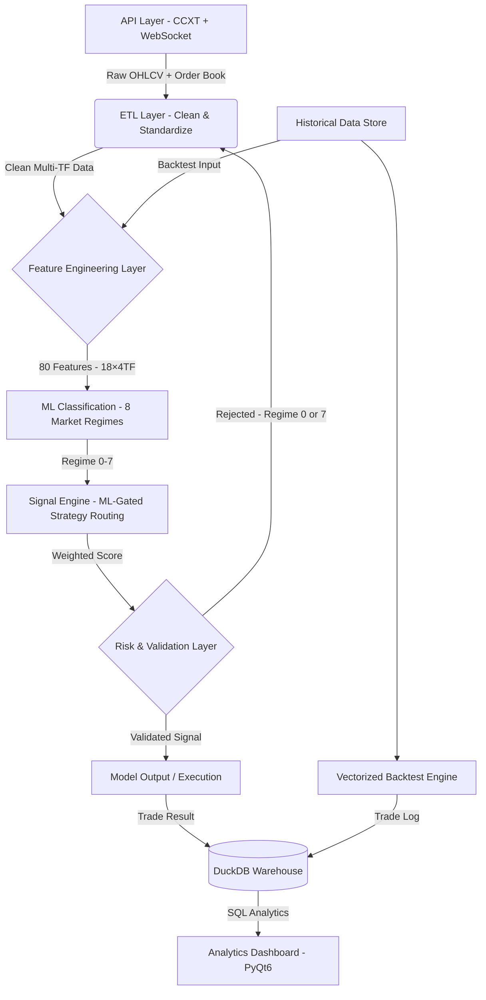

<div align="center">


# KAIROS QUANT SYSTEM
### End-to-End Data Analytics Pipeline for Financial Market Research

[](https://www.python.org/)
[](https://www.binance.com/)
[](https://opensource.org/licenses/MIT)
[](.)

**Stack:** `Python 3.12+` • `Pandas` • `Polars` • `PyTorch` • `DuckDB` • `PyQt6` • `CCXT`

</div>

<div align="left">

---

## Quick Start

Want to run it immediately? Follow these 3 steps:

```bash
# 1. Clone repository and install dependencies
git clone https://github.com/PVinh-Quant/Kairos-v2 && cd Kairos-v2 && pip install -r requirements.txt

# 2. Run the main program
python main.py

# 3. Select mode (Demo, Backtest, Optimize, Dashboard)
```

See [Installation & Setup](#11-requirements--installation) for more details.

---

## Core Capabilities & Value Proposition

**KAIROS QUANT SYSTEM** is an end-to-end data analytics and quantitative research platform designed to help strategy developers and traders transform raw market data into investment decisions backed by statistical rigor and machine learning.

### 🎯 Core Value & Utility (Why Kairos?)
* **Eliminate Look-Ahead Bias:** A strict 4-step multi-timeframe alignment pipeline guarantees that backtested signals reflect exactly what was historically available at the moment of execution.
* **Rigorous Statistical Validation:** Eliminate "lucky" parameters and overfitting via Walk-Forward Validation and Deflated Sharpe Ratio (DSR) metrics.
* **100x+ Research Acceleration:** High-performance vectorized computations powered by Polars & Pandas allow you to backtest millions of rows of data in seconds.
* **Zero Train-Serve Skew:** The exact same feature-generation logic (`calc_core_features`) is shared between offline ML training and real-time live trading.

---

### ⚙️ Main System Functionalities

| Core Feature | Description |
|---|---|
| **Automated ETL Pipeline** | Raw API $\rightarrow$ Clean Dataset. Automatically downloads multi-timeframe OHLCV (1m–1d) from Binance, OKX, and Bybit using CCXT & WebSockets. Handles timestamp alignment and auto-fills missing candles. |
| **Feature Engineering Engine** | Calculates 49 technical indicators in parallel across 8 timeframes (including Price Structure/SMC, Volume Profile, proxy CVD, and session indicators). |
| **Market Regime Classifier** | A PyTorch ResBlock MLP neural network that classifies market conditions into 8 distinct regimes to adaptively route capital and strategies. |
| **Multi-Mode Backtester** | Supports realistic single/multi-threaded bar-by-bar simulations (to prevent execution leaks) and lightning-fast Vectorized Backtesting. |
| **Bayesian Hyperparameter Optimizer** | Automates parameter searches using Bayesian optimization combined with Walk-Forward tests, outputting deployable strategy parameters in JSON. |
| **DuckDB SQL Analytical Warehouse** | Stores all execution logs and backtest records in an embedded DuckDB database for cross-run, ad-hoc SQL performance profiling. |
| **Interactive PyQt6 Dashboard** | Desktop UI containing: Analytics Dashboard (equity, drawdown, heatmaps), Real-time Monitor for live positions, and the Indicator Live Workbench sandbox. |
| **Live & Paper Trading Execution** | Connects to exchange APIs to manage orders, positions, and stops (SL/TP) in real-time or paper trading mode via CCXT. |

-----

### Analytics Dashboard Preview


-----

## Key Results & Achievements

| Achievement | Detail |
|-----------|---------|
| Big Data Processing | Parallel processing of millions of historical rows (multi-year, multi-asset) without memory leaks. |
| Computation Speed | Vectorization reduces calculation time from hours to minutes for the same data volume. |
| No Look-Ahead Bias | Carefully designed multi-timeframe feature alignment prevents data leaks, aligning backtesting closely with live trading. |
| Integrated Data Warehouse | Every backtest execution is stored in DuckDB, enabling multi-run cross queries (winrate, PnL, drawdown by hour/day/regime). |
| Statistical Validation | Walk-Forward validation combined with Deflated Sharpe Ratio (DSR) and OOS/IS ratio builds confidence before deployment. |
| Fully Automated | End-to-end automation from data ingestion, cleaning, feature engineering, modeling, storing, to PyQt6 visualization. |

## Table of Contents

1. [Vision & Methodology](#1-vision--methodology) — Core philosophy, key quantitative problems.
2. [System Overview](#2-system-overview) — 8 operating modes, modular architecture.
3. [Core Skills & Technologies](#3-core-skills--technologies) — Data engineering, ML, visualization.
4. [Data Ingestion & Ingress Pipeline](#4-data-ingestion--ingress-pipeline) — ETL, OHLCV resampler.
5. [Feature Engineering & Ensemble Scoring](#5-feature-engineering--ensemble-scoring) — 49 indicators, 8 timeframes.
6. [ML Pipeline: Regime Classification](#6-ml-pipeline-regime-classification) — 8 market regimes, PyTorch model.
7. [Analytics Dashboard, Optimizer & Indicator Live](#7-analytics-dashboard-optimizer--indicator-live) — PyQt6 apps, Walk-Forward.
8. [SQL Analytics & Data Warehouse](#8-sql-analytics--data-warehouse) — DuckDB embedded warehouse.
9. [Risk Management & Validation Guardrails](#9-risk-management--validation-guardrails) — Quality control, ATR stops, dynamic leverage.
10. [Directory Layout](#10-directory-layout) — Project structure.
11. [Requirements & Installation](#11-requirements--installation) — CLI steps and packages.
12. [Configuration & Running Guide](#12-configuration--running-guide) — CLI menu, configs.
13. [Roadmap](#13-roadmap) — Future development suggestions.
14. [Tutorial: Researching a Strategy from Scratch](#14-tutorial-researching-a-strategy-from-scratch) — Step-by-step quant workflow.
15. [Risk Disclaimer](#15-risk-disclaimer) — Performance warnings.
16. [Author's Note](#16-authors-note) — Development thoughts.
17. [Detailed Technical Reference Manual](#17-detailed-technical-reference-manual) — Deep dives.

-----

<a name="1"></a>

## 1. VISION & METHODOLOGY

**KAIROS QUANT SYSTEM** represents an institutional-grade quantitative research and execution ecosystem. The platform enforces a scientific, data-driven approach to algorithmic trading: **every trading hypothesis must be quantified and validated statistically against historical data before deployment**.

### Core Philosophy

> **"Data is the only source of truth. Every investment assumption must pass rigorous statistical verification."**

### Core Problems Addressed

| # | Trader Challenge | KAIROS Solution |
|---|------------------|-----------------|
| 1 | **Siloed and fragmented data:** Handling raw data from multiple exchanges and formats is complex and error-prone. | **Unified ETL Pipeline:** Standardizes multi-source REST/WebSocket data into a single, clean Source of Truth. |
| 2 | **Look-Ahead Bias / Data Leaks:** Backtests show unrealistically good results due to using future information. | **Anti-Leakage MTF Engine:** A strict 4-step timestamp alignment process ensuring backtests reflect 100% reality. |
| 3 | **Overfitting / Backtest Over-optimization:** Strategies look perfect on past data but fail quickly in live markets. | **Walk-Forward Validation & DSR:** Multi-phase split-testing combined with Deflated Sharpe Ratio calculation to filter out luck. |
| 4 | **Lack of adaptability to market shifts:** Fixed strategies lose edge when market conditions transition. | **ML Regime Router (PyTorch):** Identifies 8 distinct market regimes to dynamically route capital to optimal strategies. |

### Data Science Lifecycle

| Stage | Tech Stack | Value Added |
|-----------|-------------------|------------------|
| **Ingest** | REST API (CCXT) + WebSocket streams | Automatically ingests historical OHLCV and real-time market streams. |
| **Clean** | Multi-TF resampling & gap-filling | Normalizes timestamps and automatically recovers missing candles. |
| **Feature**| 49 indicators across 8 timeframes | High-performance feature engineering using Polars/Pandas. |
| **Validate**| Walk-forward backtester | Simulates performance without look-ahead bias or survival bias. |
| **Model** | Regime Classification (ResBlock MLP) | Classifies market behaviors using deep neural network states. |
| **Analyze**| DuckDB SQL Analytical Warehouse | Evaluates and cross-compares performance across multiple runs. |

-----

<a name="2"></a>

## 2. SYSTEM OVERVIEW & OPERATING MODES

**KAIROS** is structured as a **closed-loop data analytics ecosystem**, integrating research, validation, and execution into a single unified workspace.

### Modular Architecture

The codebase strictly adheres to:
> **"Decoupled, Stateless Modules (Zero Shared External State Dependency)"** — Every class and function receives explicit inputs and returns deterministic outputs.

This allows quant developers to easily test individual pipeline layers in isolation, perform unit testing, and update machine learning models without breaking the operational pipeline.

### 8 Operating Modes

The interactive Command-Line Interface (CLI) allows researchers to run 8 specialized modes matching various stages of quant development:

| Mode | Operation | Target Use Case | Target Audience |
|:---:|---|---|---|
| **1** | **Realtime Trading** | Integrates with exchange APIs to execute real trades. | Live Traders |
| **2** | **Demo / Paper** | Processes real-time data and logs virtual executions. | Risk-Free Live Testing |
| **3** | **Backtest (1-thread)** | Runs bar-by-bar historical simulation on a single CPU thread. | Single Strategy Testing |
| **4** | **Backtest (Multi-thread)** | Simulates multiple asset classes in parallel using multiple CPUs. | Portfolio Backtesting |
| **5** | **Vectorized Backtest** | Performs ultra-fast vectorized matrix backtesting (~100x speedup). | Large-Scale Screening |
| **6** | **ML Training** | Runs data labeling, training, and testing of PyTorch models. | Machine Learning Engineers |
| **7** | **Dashboard (PyQt6)** | Launces the multi-tab interactive desktop graphical interface. | Visual Analysis & Sandboxing |
| **8** | **Hyperparameter Opt** | Performs Walk-Forward optimization on parameters via CLI. | Automated Parameter Tuning |

-----

<a name="3"></a>

## 3. CORE SKILLS & TECHNOLOGIES

### Data Engineering & Time-Series Ingress

* **Robust ETL Pipelines:** Handles automatic ingestion, validation, and storage of price data across several leading exchanges.
* **Multi-Timeframe Time-Series Processing:** Safely resamples and aggregates 1-minute base data into higher timeframes (HTF) without data leakage.
* **Vectorized Computations:** Replaces slow loops with vectorized math via **Polars** and **Pandas**, shrinking feature calculation times from hours to seconds.
* **Real-time Orderflow Streams:** Ingests live WebSocket data for order book depth, CVD, and liquidation statistics.

### Feature Engine — 49 Technical Indicators on 8 Timeframes

The platform comes pre-configured with a rich set of indicators split across 7 categories:

| Feature Category | Pre-integrated Indicators | Count |
|---|---|:---:|
| **Trend** | EMA, SMA, ADX, Ichimoku, SuperTrend, MACD, Parabolic SAR, Aroon, Vortex | 9 |
| **Momentum** | RSI, Stochastic %K/%D, CCI, Williams %R, ROC, MFI, Awesome Oscillator, TSI, Ultimate Oscillator | 9 |
| **Volatility** | ATR, Bollinger Bands + Squeeze, Keltner Channel, Donchian Channel, Historical Volatility, Chaikin Volatility, ATR Bands | 7 |
| **Volume** | Volume MA, Volume MA Dual, OBV, VWAP, Volume Profile (POC/VAH/VAL), CMF, A/D Line, MFI Volume, Ease of Movement | 9 |
| **Price Structure** | Breakout, ZigZag, Fractals, Pivot Points, FVG (Fair Value Gap), Heikin Ashi, Market Structure (BOS/CHoCH), Order Blocks, Support/Resistance | 9 |
| **Market Sentiment** | CVD (approximated), Funding Rate, Order Book Imbalance, Liquidation Data | 4 |
| **Session & Cycle** | Asian / London / New York sessions, Session Range H/L | 2 |

> 💡 *Details on indicator parameters and logic can be found in the [Technical Indicator Reference](detailed_documentation.md#indicator-engine).*

### Machine Learning & Data Warehousing

* **PyTorch Residual Networks:** Implements MLP neural networks using Residual Blocks (ResBlock) with BatchNorm and Dropout layers to map market dynamics without overfitting.
* **80-Dimensional Feature Ingress:** Automatically extracts 18 indicators across 4 timeframes alongside market state memories (80-dim feature vector) using Polars.
* **DuckDB Storage:** Integrates a local analytical serverless DuckDB database to write and query execution metrics with speed.

-----

<a name="4"></a>

## 4. END-TO-END DATA PIPELINE ARCHITECTURE

The system splits functionality into decoupled, single-responsibility layers (Separation of Concerns), ensuring ease of maintenance and extensibility.



*   **Layer 1 — Data Acquisition (`/lay_du_lieu`):** Interfaces with exchange endpoints to fetch OHLCV candles, order books, and macro sentiments.
*   **Layer 2 — Feature Generation (`/chien_luoc/phan_tich_ky_thuat`):** Extracts strategy signals (48 indicators) and ML feature vectors (80 dimensions) in parallel.
*   **Layer 3 — Machine Learning Core (`/ml`):** Classifies market regimes. Halts trading in high-risk zones (regime 0 and 7) and permits execution in regimes 1-6.
*   **Layer 4 — Strategy Gating & Ensemble (`/chien_luoc`):** Dynamically scores and gates 5 underlying strategies (Breakout, Squeeze, Trend Following, Mean Reversion, Scalping) based on the active ML regime.
*   **Layer 5 — Analytical Database (`/utils/kho_du_lieu.py`):** Saves all executions and configurations under unique `run_id` keys in DuckDB.
*   **Layer 6 — User Interface (`/hien_thi`):** Renders PyQt6 dashboards displaying equity curves, heatmaps, and interactive strategy workbench.

-----

<a name="5"></a>

## 5. FEATURE ENGINEERING & SIGNAL SCORING

### Anti Look-Ahead Data Ingress Pipeline

To prevent look-ahead bias in multi-timeframe backtesting, higher timeframe (HTF) features are generated from 1-minute bars using a 4-step pipeline:

1. **Resample:** Aggregates 1M candles into higher timeframe bars.
2. **Shift Index:** Shifts the timestamp of calculated HTF values to the future by exactly the length of the bar (ensuring the values are only accessed when the candle has closed).
3. **Forward-fill:** Fills forward the closed HTF values to the corresponding subsequent 1M bars.
4. **Live Indicator:** Combines locked historical values with the current forming 1M close for dynamic signals.

### Ensemble Gating & Scoring

Kairos integrates signals from multiple analytical models:

| Analytical Module | Description | System Role |
|---|---|---|
| `xu_huong.py` | Measures trends via EMAs, SMAs, ADX, and Ichimoku. | Tracks primary market directions. |
| `cau_truc_gia.py` | Detects FVGs, Support/Resistance, and BOS/CHoCH. | Finds breakout and reversal zones. |
| `khoi_luong.py` | Monitors volume surges, OBV, and VWAP deviation. | Validates price action sustainability. |
| `dong_luong_dao_chieu.py` | Measures price momentum (RSI, MACD, Stochastic). | Warns of exhaustion/overextended zones. |
| `bien_dong.py` | Evaluates range/spreads (ATR, Bollinger Squeezes). | Sets SL/TP limits and leverage sizing. |
| `vi_the.py` | Tracks sentiment and delta positionings (proxy CVD). | Evaluates market crowd positioning. |
| `chu_ky.py` | Tracks active session hours (Asia/London/NY). | Filters out low-liquidity zones. |

**Ensemble Formula:**
$$\text{Total Score} = \sum \left( \text{Feature\_Score}_i \times \text{Weight}_i \times \text{Timeframe\_Multiplier} \right)$$
$$\text{Decision} = \begin{cases} 
\text{BUY} & \text{if } \text{Total Score} \ge \text{Threshold} \\ 
\text{SELL} & \text{if } \text{Total Score} \le -\text{Threshold} \\ 
\text{HOLD} & \text{otherwise} 
\end{cases}$$

Weights change dynamically depending on the PyTorch ML regime. In a ranging (Sideway) regime, the weights of trend-following features drop, while mean-reversion weights increase to adapt to changing dynamics.

-----

<a name="6"></a>

## 6. MACHINE LEARNING ENGINE: REGIME CLASSIFICATION

### Multi-class Classification Model

* **Input:** 80-dimensional feature vector containing indicators across 4 key timeframes combined with memory states.
* **Output:** One of 8 market regimes used for strategy gating:

| Regime | Label | Strategy Activation |
|:---:|---|---|
| **0** | `Frozen` | Suspends execution (Low liquidity/flat). |
| **1** | `Squeezing` | Activates Squeeze strategy (Expecting breakouts). |
| **2** | `Early Trend` | Activates Breakout strategy (Fast trend entry). |
| **3** | `Strong Trend` | Activates Trend Following strategy (Trend riding). |
| **4** | `Climax` | Activates Mean Reversion (Overextended reversals). |
| **5** | `Retracement` | Activates Mean Reversion (Targets VWAP/EMA). |
| **6** | `Turbulent` | Activates Scalping (Short ranges). |
| **7** | `Liquidation Sweep` | Suspends execution (High volatility/extreme risk). |

### Machine Learning Flow (ML Pipeline)
```text
Raw OHLCV Data (1m)
    ↓ Feature Ingestion (Polars - tao_feature.py) → 80-dim feature vector
    ↓ Automated Label Generation (trading_teacher.py) → Labeled Dataset
    ↓ Model Training (TradingMLP PyTorch: 3 ResBlocks, BatchNorm, Dropout)
    ↓ Performance Evaluation (Confusion Matrix, Walk-forward OOS Splits)
    ↓ Serialization (Saves model weights model_pytorch.pth and scaler_params.json)
    ↓ Real-time Inference (Bar-by-bar execution ~20ms / Vectorized batch ~500ms)
```

-----

<a name="7"></a>

## 7. VISUALIZATION & INTERACTIVE RESEARCH DASHBOARD

The platform includes a PyQt6 multi-tab desktop dashboard that acts as a strategy development workstation:

### 7.1 Backtest Analytics
Review backtest results via `hien_thi/dashboard_backtest.py`:
* **Equity & Drawdown Curves:** Visualizes compounding growth alongside maximum drawdown percentages.
* **Daily PnL Calendar:** Displays PnL on a monthly calendar grid. Click a day to view its trades.
* **Session Heatmap:** Maps Win Rates across Hour of Day × Day of Week to find optimal trading windows.
* **Duration vs. PnL Scatter Plot:** Plots hold times against trade profit to diagnose psychological trading errors (e.g., cutting wins early, letting losses run).

### 7.2 Live/Demo Monitor
Monitor operations: `hien_thi/dashboard_demo.py` or `hien_thi/dashboard_realtime.py`:
* **Signal Grid Heatmap:** Displays active buy/sell/hold signals across symbols and timeframes.
* **Active Positions:** Tracks entry price, leverage, size, unrealized PnL, and hold durations.
* **Trade History Log:** Displays historical closures along with exit reasons (Stop Loss, Take Profit, reversal).

### 7.3 Vectorized Chart UI
* Renders candlestick charts overlaying entry (green triangles) and exit (orange crosses) markers via `hien_thi/dashboard_vectorized.py`.
* Click any trade in the log to instantly jump to the corresponding point on the chart.

### 7.4 Walk-Forward Parameter Optimizer
* **Methodology:** Automatically searches parameters via Bayesian optimization, testing In-Sample (IS) and verifying Out-of-Sample (OOS).
* **Gatekeeper Rules:** Rejects strategies unless they meet the following: Deflated Sharpe Ratio (DSR) $\ge$ 90%, Sharpe OOS/IS ratio $\ge$ 0.8, OOS Trades $\ge$ 30, and Profit Factor $\ge$ 1.2.
* **Performance:** High-performance, in-memory multi-threaded calculations with early stopping support.

### 7.5 Indicator Live Workbench
* Change parameters on a slider (e.g., MA period, RSI levels), and the system instantly recalculates features via Polars, redrawing trade markers on the chart in real time.

-----

<a name="8"></a>

## 8. SQL ANALYTICS WAREHOUSE (DUCKDB INTEGRATION)

Kairos records all execution history into a local **DuckDB** file-based database.

* **Multi-Mode Storage:** Automatically indexes data from all 5 operating modes (single/multi-threaded backtests, vectorized tests, demo, and live execution) linked by a unique `run_id`.
* **SQL Querying:** Standardizes performance analytics (Win rates, Monte Carlo simulations, streak analytics, and regime transitions) using SQL queries.

### Querying Performance by ML Regime

```sql
SELECT regime, regime_name, COUNT(*) as trades, AVG(pnl) as avg_pnl, SUM(pnl) as total_pnl
FROM backtest_records WHERE run_id = 'run_2026_07_abc' GROUP BY regime;
```

| regime | regime_name | trades | winrate_pct | total_pnl | avg_pnl |
|:---:|---|---|---|---|---|
| **3** | `Strong Trend` | 142 | 61.3% | +842.5 USDT | +5.9 USDT |
| **2** | `Early Trend` | 98 | 54.1% | +310.2 USDT | +3.2 USDT |
| **6** | `Turbulent` | 215 | 44.2% | -180.4 USDT | -0.8 USDT |
| **4** | `Climax` | 76 | 48.7% | -42.1 USDT | -0.6 USDT |

*Analysis:* The query output clearly identifies `Turbulent (6)` as the poorest performing regime. Developers can use this data to disable strategy execution in regime 6.

-----

<a name="9"></a>

## 9. RISK MANAGEMENT & CAPITAL PROTECTION GUARDRAILS

The system implements multiple protection layers to guard capital:

* **Dynamic ATR-Scaled Stops:** Stop Loss and Take Profit bounds stretch and contract based on market volatility (ATR), clamped inside safe parameters (SL: 0.5%–15%, TP: 1%–30%).
* **Multi-Factor Leverage Sizing:** Calculates leverage sizing based on volatility (ATR), trend strength (ADX), volume surges, Squeezes, and breakout signals, capped at maximum limits.
* **Emergency Drawdown Clamps:** Monitors maximum drawdown in real-time, automatically closing active positions and suspending trading if daily limits are breached.

----- *For formulas regarding ATR-scaled stops and dynamic leverage, see [Strategy & Execution](detailed_documentation.md#chien-luoc) in the technical manual.*

-----

<a name="10"></a>

## 10. DIRECTORY LAYOUT

```text
Kairos-v2/
├── main.py                              # Entry point – menu router
├── requirements.txt
│
├── config/                              # SYSTEM CONFIGURATION
│   ├── cau_hinh_giao_dich.yaml          # Traded symbols, leverage, risk params
│   ├── cau_hinh_ao_config.json          # Backtest & simulation config
│   ├── tai_khoan_api.json               # Exchange API keys (gitignore)
│   ├── tai_khoan_api.json.example       # Template for API credentials
│   └── thong_tin_san.yaml               # Exchange step sizes and fees
│
├── lay_du_lieu/                         # ETL LAYER – Data Ingestion
│   ├── lay_ohlcv.py                     # Historical CCXT OHLCV down loaders
│   ├── lay_marketsnapshot.py            # WebSocket Orderbook/CVD streams
│   ├── lay_macro.py                     # Macro indicators (OI, Fear & Greed)
│   └── lay_thong_tin_tai_khoan.py       # Balance, positions, execution history
│
├── Indicator/                           # FEATURE ENGINE (Base Public Edition)
│   ├── xu_huong.py                      # Trend indicators
│   ├── dong_luong_dao_chieu.py          # Momentum indicators
│   ├── bien_dong.py                     # Volatility indicators
│   ├── khoi_luong.py                    # Volume indicators
│   ├── cau_truc_gia.py                  # Price structure indicators
│   ├── vi_the.py                        # Sentiment indicators
│   ├── chu_ky.py                        # Cycles indicators
│   └── Indicator_mid / Indicator_high   # Advanced Indicators - CLOSED SOURCE
│
├── chien_luoc/                          # FEATURE ENGINEERING & SIGNAL LAYER
│   ├── logic_bar_to_bar/                # Realtime Stream Engine (Polars)
│   │   ├── phan_tich_ky_thuat/          # Indicators (49 Base Indicators)
│   │   ├── chien_luoc/                  # 5 strategies (Bar-to-Bar scoring)
│   │   ├── quan_ly_chien_luoc.py        # Strategy weight controller based on ML regime
│   │   ├── chien_luoc_don_bay.py        # Multi-factor dynamic leverage
│   │   └── stoploss_takeprofit.py       # ATR-scaled dynamic SL/TP
│   │
│   └── logic_vectorized/                # Batch Matrix Engine (Pandas)
│       ├── phan_tich_ky_thuat/          # Technical indicators (Vectorized)
│       ├── chien_luoc/                  # 5 strategies (Vectorized scoring)
│       └── quan_ly_chien_luoc.py        # Signal aggregation and ML gating
│
├── ml/                                  # ML PIPELINE (PyTorch)
│   ├── main.py                          # ML Training Orchestrator
│   ├── tool/                            # Auto-labeling, filters, regime plots
│   └── trang_thai_thi_truong_ml/        # Feature extraction, model & inference
│
├── chuc_nang/                           # PIPELINE RUNNERS
│   ├── chay_realtime.py                 # Live Trading connector
│   ├── chay_demo.py                     # Paper Trading simulation
│   ├── backtest_donluong.py             # Single-threaded Backtester
│   ├── backtest_daluong.py              # Parallel Backtester
│   └── vectorized_backtest.py           # Matrix-based Backtester
│
├── toi_uu_hoa/                          # OPTIMIZER (Walk-Forward)
│   ├── bo_dieu_phoi.py                  # Walk-Forward & DSR coordinator
│   ├── dong_co_backtest.py             # In-memory backtest engine
│   ├── kiem_dinh.py                     # Verification: DSR, Sharpe limits
│   ├── dang_ky_chi_bao.py               # Indicator search parameters
│   └── giao_dien_cli.py                 # CLI interface using Rich
│
├── toi_uu_hoa_high/                    # Advanced Parameter Optimizer - CLOSED SOURCE
│
├── thuc_thi_lenh/                       # ORDER EXECUTION
│   ├── bo_may_thuc_thi.py               # Singleton Connection Manager
│   ├── mo_lenh.py / dong_lenh.py        # Open/Close order calls (Market/Limit)
│   ├── quan_ly_lenh.py                  # Open positions manager
│   └── ket_noi_san/                     # Binance, Bybit, OKX connector drivers
│
├── hien_thi/                            # VISUALIZATION (PyQt6)
│   ├── app/ung_dung.py                  # Main PyQt6 App shell
│   └── man_hinh/                        # PyQt6 Views
│       ├── toi_uu/                      # Parameter Optimizer builder GUI
│       ├── nen_thu_cong/               # Indicator Live manual workbench
│       ├── bieu_do_nen/                # Candlestick plotting view
│       ├── backtest/                    # Equity, drawdown, scatter, heatmap plots
│       └── realtime.py / demo.py        # Live monitoring GUI
│
├── thong_bao/                           # NOTIFICATIONS
│   ├── gui_email.py                     # Email reports
│   └── gui_telegram.py                  # Telegram notifications
│
├── utils/                               # UTILITIES
│   ├── ham_tien_ich.py                  # Multi-timeframe merge & anti-look-ahead
│   ├── kho_du_lieu.py                   # DuckDB data warehouse connector
│   └── log.py / doc_cau_hinh.py         # Logger & YAML parser
│
└── du_lieu/                             # DATA STORAGE
    ├── lich_su_gia/                     # Historical CSV files
    ├── kairos_warehouse.duckdb          # DuckDB database file
    └── nhat_ky_hoat_dong.log            # Application log file
```

-----

<a name="11"></a>

## 11. YÊU CẦU & HƯỚNG DẪN CÀI ĐẶT

```bash
# Clone the repository
git clone <repo>
cd kairos-v2

# Install dependencies
pip install -r requirements.txt
```

**Core Libraries:**

| Library | Purpose |
|---|---|
| `pandas`, `polars` | Data processing & feature engineering |
| `numpy` | Vectorized computations |
| `pytorch` | ML model training & inference |
| `scikit-learn`, `joblib` | ML preprocessing, metrics |
| `ta` | Technical analysis indicators (RSI, ATR, ADX...) |
| `ccxt` | Exchange API connector — Binance, OKX, Bybit |
| `pyqt6`, `pyqtgraph`, `matplotlib` | Analytics dashboard & charting |
| `websocket-client` | Streaming data pipeline |
| `duckdb` | Embedded SQL analytics — data warehouse |
| `rich` | Structured terminal logging |

-----

<a name="12"></a>

## 12. HƯỚNG DẪN CẤU HÌNH & KHỞI CHẠY

### 12.1 Configuration & main menu commands

Copy API key credentials:
```bash
cp config/tai_khoan_api.json.example config/tai_khoan_api.json
# Edit config/tai_khoan_api.json
# Adjust config/cau_hinh_giao_dich.yaml (symbols, leverage, balance)
python main.py
```

The system initializes the main CLI dashboard using the `rich` library:

```text
 ┌────────────────────────────────────────────────────────────────────────────────────────┐
 │                     ██╗  ██╗ █████╗ ██╗██████╗  ██████╗ ███████╗                       │
 │                     ██║ ██╔╝██╔══██╗██║██╔══██╗██╔═══██╗██╔════╝                       │
 │                     █████╔╝ ███████║██║██████╔╝██║   ██║███████╗                       │
 │                     ██╔═██╗ ██╔══██║██║██╔══██╗██║   ██║╚════██║                       │
 │                     ██║  ██╗██║  ██║██║██║  ██║╚██████╔╝███████║                       │
 │                     ╚═╝  ╚═╝╚═╝  ╚═╝╚═╝╚═╝  ╚═╝ ╚═════╝ ╚══════╝                       │
 │                                  Analytics System v2                                   │
 ├──────────────────────────────────────────────┬─────────────────────────────────────────┤
 │  Menu                                        │  Current Config                         │
 │  ──────────────────────────────────────────  │  ────────────────────────────────────── │
 │  LIVE TRADING                                │  Symbols:   BTC/USDT, ETH/USDT...       │
 │  [1] Realtime Trading     (CCXT Live)        │  Leverage:  7x                          │
 │  [2] Demo / Paper Trading (Risk Free)        │  Backtest:  2024-01-01 → 2024-12-31     │
 │                                              │  Capital:   10,000 USDT                 │
 │  BACKTESTING                                 ├─────────────────────────────────────────┤
 │  [3] Backtest Single Thread (Bar-to-Bar)     │  Author                                 │
 │  [4] Backtest Multi-Thread  (Parallel)       │  P. Vinh - Quant Research & Dev         │
 │  [5] Vectorized Backtest    (100x+ Matrix)   │                                         │
 │                                              │  "Romain Rolland: 'There is only one    │
 │  AI / ML                                     │   heroism in the world: to see the      │
 │  [6] ML Training            (Train & Deploy) │   world as it is, and to love it.'"     │
 │                                              │  ────────────────────────────────────── │
 │  ANALYTICS                                   │  Kairos v2 · 2026                       │
 │  [7] Dashboard Analytics    (PyQt6 GUI)      │─────────────────────────────────────────┘
 │                                              │
 │  OPTIMIZATION                                │
 │  [8] Parameter Optimization (Walk-Forward)   │
 │                                              │
 │  [0] Exit                                    │
 └──────────────────────────────────────────────┘
```

> [!NOTE]
> KAIROS uses **Lazy Importing**. Large libraries (PyTorch, PyQt6, CCXT) are only loaded when their respective mode is selected. CLI startup takes <100ms.

-----

<a name="13"></a>

## 13. ROADMAP

*This represents a proposal from the developer, not a commitment.*

The developer plans to **restrict future development on KAIROS v2** to focus resources on **KAIROS v3**. The proposed final additions for v2 are:

**Integrate Non-OHLCV Data as Gating Filters for Live Trading**: Hook Open Interest, CVD, Websocket volumes, and liquidation streams (already available in `/lay_du_lieu/`) into strategy routing rules (`chien_luoc/quan_ly_chien_luoc.py`). Use these orderflow indicators to block trades when technical indicators are triggered at inappropriate timeframes or market regimes.

Implementation order: Solidify OHLCV models → Link WebSocket orderflow streams → Validate in Demo/Live modes (not backtestable).

-----

<a name="14"></a>

## 14. TUTORIAL: RESEARCHING A STRATEGY FROM SCRATCH

Follow this workflow to research and deploy a strategy in KAIROS:

```text
Load Historical Market Data
        │
        ├──────────────────────────────────┐
        ▼                                  ▼
Research Signal Logic              Train Machine Learning Model
(logic_vectorized)                 (ml/trang_thai_thi_truong_ml)
        │                                  │
        └──────────────┬───────────────────┘
                       ▼
            Vectorized Backtest  ← Fast iterations, rough parameter search
                       │
                       ▼
            Bar-to-Bar Backtest  ← Accurate validation (adds SL/TP, fees)
                       │
                       ▼
            Demo / Paper Trading ← Live market validation without risk
                       │
                       ▼
               Live Trading      ← Real money execution, start small
```

**6 Sequential Phases:**
1. **Load Historical Data** — Collect multi-year historical datasets. Scan and clean any gaps.
2. **Strategy Research (2a)** — Write signal rules in `logic_vectorized/chien_luoc/`. Ensure your outputs are scored between `-1.0` and `+1.0`.
3. **ML Regime Research (2b)** — Train the regime classifier using option `[6] ML Training` from the CLI menu.
4. **Vectorized Backtests** — Run fast simulations to evaluate the strategy's statistical edge. Target a Profit Factor > 1.3 on Out-of-Sample data.
5. **Bar-to-Bar Backtests** — Simulate under realistic conditions (slippage, execution delay, trailing ATR stop). If results drop by >30% compared to vectorized tests, check for look-ahead leaks.
6. **Demo → Live** — Run in Demo mode for 2-4 weeks. If paper trading is successful, deploy to live trading starting with 10-20% of capital allocation.

-----

<a name="15"></a>

## 15. RISK DISCLAIMER

**Regarding Backtest Performance**: Backtesting relies entirely on historical data. **Past performance does not guarantee future results**. Market conditions and structures change over time.

**System Limitations**: Backtesting calculates performance on 1m OHLCV bars, not tick-by-tick order books. Live slippage, fees, and execution delays can vary. Orderflow orderbook datasets are only available in Live/Demo modes.

**ML Regime Classification**: Machine learning models assume stationary market features. Model drift can occur during unexpected market volatility or structural breaks.

**Disclaimer**: This codebase is meant for **educational, academic, and research purposes**. It is not investment advice.

### Editions

This public repository contains the open-source **Base edition (Proof-of-Concept)**. The advanced editions of the indicator feature engines and parameter optimizers are kept proprietary:

| Engine | Public Base Edition (PoC) | Closed-source Commercial Editions |
|---|---|---|
| **Indicator** | `Indicator/` | `Indicator_mid` · `Indicator_high` — advanced features with MTF Live Hybrid updates |
| **Optimizer** | `toi_uu_hoa/` | `toi_uu_hoa_high` — adaptive search with faster convergence |

> Licensing inquiries regarding proprietary engines should be directed to the developer.

-----

<a name="16"></a>

## 16. AUTHOR'S NOTE

I did not start this project to become a trader. I started it because financial markets are one of the few data science problems that give you an honest answer: if your code is wrong, your backtest will fail immediately; if your methodology is wrong, reality will not spare your capital.

KAIROS v2 was built entirely on OHLCV. Over time, I realized a fundamental limitation: OHLCV is the most public information in the world and is already reflected in the price. No matter how sophisticated a pipeline is, if it only looks at price candles, it is only describing what has already happened. Realizing this did not discourage me — it gave me a clearer understanding of what I was doing.

If I had to choose the two most difficult challenges, I would say **HTF alignment and ML** — harder than everything else combined. HTF is hard because bugs are silent — you can write a multi-timeframe pipeline that looks correct, produces beautiful curves, and yet have no idea that your 4h indicator is looking into the future. There are no exceptions, no warnings — only fake win rates. And ML is hard because of the *problem design*: how do you generate labels that are not circular? How do you prevent look-ahead leaks from slipping into the training features? And the hardest part: how do you know if your model is *learning* or just *memorizing*.

Along with the challenges, there were a few design decisions worth getting right from the beginning: using a single `calc_core_features()` for both training and live inference — change the formula in one place, and both pipelines stay synchronized. Signals appear at bar N, but orders are executed at the `open` of bar N+1. Running two parallel backtesting engines (`logic_bar_to_bar` and `logic_vectorized`) acts as a form of internal cross-validation — when results mismatch, it indicates a discrepancy in simulation rules rather than a strategy flaw.

KAIROS v2 will stay as it is — honest about what it can and cannot do. The next step is **KAIROS v3**, where the problem is redesigned from scratch around multi-source orderflow data ingestion pipelines.

*Sometimes the straightest path to where you want to go is the winding path through where you needed to make mistakes first.*

-----

<a name="17"></a>

## 17. DETAILED TECHNICAL REFERENCE MANUAL

All developer deep-dives, configuration references, database schemas, and order execution flows are detailed in:

👉 **[Detailed Technical Reference Manual](detailed_documentation.md)**

| Section | Content | Link |
|---|---|---|
| Configuration | YAML, JSON, API keys, gitignore | [→ Details](detailed_documentation.md#configuration) |
| Ingestion Layer | WebSocket streams, ETL, macro data | [→ Details](detailed_documentation.md#data-pipeline) |
| Indicators & Strategy | 49 indicators, look-ahead prevention, MTF alignment | [→ Details](detailed_documentation.md#indicator-engine) |
| Machine Learning | TradingMLP, Auto-labeling, 80D features | [→ Details](detailed_documentation.md#ml-regime) |
| Order Execution | Order Execution, Position Manager, CCXT | [→ Details](detailed_documentation.md#execution-layer) |
| Operating Workflows | CLI modes, runners | [→ Details](detailed_documentation.md#system-overview) |
| UI Visualization | PyQt6 Dashboard, terminal themes | [→ Details](detailed_documentation.md#ui-dashboard) |
| DuckDB Warehouse | Schema, SQL queries, analytical queries | [→ Details](detailed_documentation.md#duckdb-warehouse) |
| Data Storage | CSV files, warehouse | [→ Details](detailed_documentation.md#duckdb-warehouse) |
| Notifications | Telegram & Email configurations | [→ Details](detailed_documentation.md#system-overview) |

-----

### AUTHOR INFO

* **Developer:** P Vinh
* **Role:** Financial Data Analyst · ML Engineer · Quant Developer
* **Stack:** Python · Pandas · Polars · PyTorch · DuckDB · PyQt6 · CCXT
* **Methodology:** Data-driven design · Statistical validation · Human logic + AI-assisted development
* **Contact:** ppvinh1513@gmail.com

*"Romain Rolland: 'There is only one heroism in the world: to see the world as it is, and to love it.'"*

</div>
