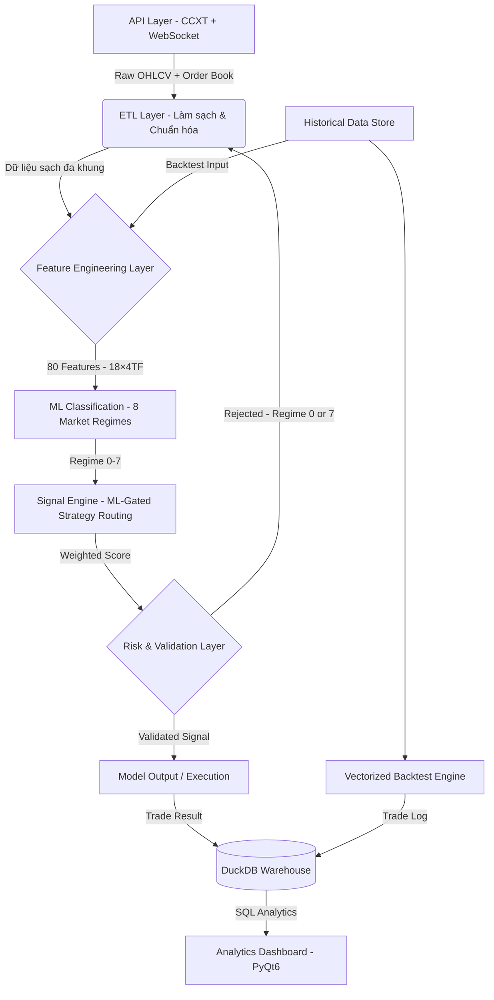

<div align="center">


# KAIROS QUANT SYSTEM
### End-to-End Data Analytics Pipeline for Financial Market Research

[](https://www.python.org/)
[](https://www.binance.com/)
[](https://opensource.org/licenses/MIT)
[](.)

**Stack:** `Python 3.12+` • `Pandas` • `Polars` • `PyTorch` • `DuckDB` • `PyQt6` • `CCXT`

</div>

<div align="left">

---

## Quick Start

Muốn chạy ngay lập tức? Thực hiện 3 bước:

```bash
# 1. Clone repository và cài đặt dependencies
git clone https://github.com/PVinh-Quant/Kairos-v2 && cd Kairos-v2 && pip install -r requirements.txt

# 2. Chạy chương trình chính
python main.py

# 3. Chọn chế độ (Demo, Backtest, Optimize, Dashboard)
```

Xem [Hướng dẫn cài đặt](#yêu-cầu--hướng-dẫn-cài-đặt) để hiểu chi tiết hơn.

---

## Chức Năng & Công Dụng Thực Tế (Core Features & Value Proposition)

**KAIROS QUANT SYSTEM** là giải pháp phân tích dữ liệu và nghiên cứu định lượng toàn diện, giúp các nhà phát triển chiến lược và giao dịch viên (Traders) chuyển hóa dữ liệu thị trường thô thành các quyết định đầu tư được chứng minh bằng toán học và học máy.

### 🎯 Giá Trị & Công Dụng Cốt Lõi (Why Kairos?)
* **Loại bỏ hoàn toàn thiên kiến Look-Ahead Bias:** Nhờ quy trình multi-timeframe 4 bước nghiêm ngặt, đảm bảo mọi tín hiệu backtest đều phản ánh chính xác dữ liệu thực tế tại thời điểm ra quyết định, không rò rỉ tương lai.
* **Quy trình nghiên cứu kỷ luật (Statistical Validation):** Đánh giá hiệu suất thông qua Walk-Forward Validation và chỉ số Deflated Sharpe Ratio (DSR) để loại bỏ các chiến lược "ăn may" do quá khớp dữ liệu lịch sử (Overfitting).
* **Tăng tốc độ nghiên cứu hơn 100 lần:** Sử dụng cơ chế Vectorization với Polars và Pandas, giúp chạy thử nghiệm hàng triệu dòng dữ liệu lịch sử trong vài giây thay vì hàng giờ.
* **Xóa bỏ sự sai lệch giữa huấn luyện và thực thi (Zero Train-Serve Skew):** Đồng bộ hoàn toàn mã nguồn tính toán chỉ báo (`calc_core_features`) giữa pha huấn luyện học máy offline và pha chạy giao dịch trực tiếp realtime.

---

### ⚙️ Các Chức Năng Chính Của Hệ Thống

| Chức năng chính | Mô tả chi tiết kỹ thuật |
|---|---|
| **Đường ống dữ liệu ETL tự động** | Raw API $\rightarrow$ Clean Dataset. Tự động tải nến OHLCV đa khung (1m–1d) từ Binance, OKX, Bybit qua CCXT & WebSocket. Đồng bộ hóa timestamp và tự động vá lỗi dữ liệu (missing candles). |
| **Kỹ thuật trích chọn đặc trưng** | 49 chỉ báo kỹ thuật chạy song song trên 8 khung thời gian (từ các mô hình SMC, Volume Profile, CVD xấp xỉ đến cấu trúc nến giá nâng cao). |
| **Học máy phân loại thị trường** | Mô hình mạng nơ-ron PyTorch ResBlock MLP phân loại thị trường thành 8 trạng thái (Market Regimes) để định tuyến vốn và chiến lược thích ứng. |
| **Kiểm thử chiến lược đa chế độ** | Hỗ trợ Backtest đơn luồng/đa luồng (mô phỏng từng thanh nến chi tiết để tránh lỗi khớp lệnh ảo) và Vectorized Backtest (tính ma trận siêu tốc). |
| **Tối ưu hóa tham số thông minh** | Tối ưu hóa tham số bằng thuật toán Bayesian với Walk-Forward, xuất ra bộ tham số tốt nhất lưu dưới dạng JSON chảy thẳng vào hệ thống thực thi. |
| **Kho dữ liệu phân tích DuckDB** | SQL Warehouse lưu trữ tập trung mọi kết quả giao dịch và backtest, hỗ trợ các truy vấn SQL phân tích chéo hiệu suất theo ngày, giờ, regime. |
| **Bảng điều khiển PyQt6 tương tác** | Giao diện đồ họa đa tab: Analytics Dashboard (equity, drawdown, heatmap), Real-time Monitor giám sát lệnh sống, và công cụ thử nghiệm tương tác nhanh Indicator Live Workbench. |
| **Thực thi lệnh & Live/Demo Trading** | Kết nối API tài khoản giao dịch, tự động quản lý vị thế, cài đặt chặn lỗ/chốt lời (SL/TP) và đặt lệnh thực tế qua thư viện CCXT. |

-----

### Minh họa Analytics Dashboard


-----

## Key Results & Achievements

| Thành tựu | Chi tiết |
|-----------|---------|
| Xử lý dữ liệu khổng lồ | Pipeline xử lý hàng triệu dòng lịch sử (nhiều năm, nhiều cặp tài sản) song song mà không vấp phải tăng trưởng bộ nhớ |
| Tốc độ tính toán | Vectorization giảm thời gian từ hàng giờ xuống vài phút cho cùng khối lượng dữ liệu |
| Không bị look-ahead bias | Multi-timeframe features được thiết kế kỹ lưỡng để tránh rò rỉ dữ liệu; mô phỏng thực tế so với realtime |
| Data warehouse tích hợp | Mỗi lần chạy backtest được lưu vào DuckDB với run_id riêng, cho phép truy vấn phân tích cross-run (winrate, PnL, drawdown theo giờ/ngày/regime) |
| Kiểm định thống kê | Walk-Forward validation kết hợp Deflated Sharpe Ratio và OOS/IS ratio là hàng rào trước khi deploy |
| Tự động hoàn toàn | Toàn bộ quy trình từ nạp dữ liệu, làm sạch, trích chọn đặc trưng, phân tích, lưu trữ đến trực quan hóa đều được tự động hóa |

## Table of Contents

1. [Tầm nhìn & Phương pháp luận](#tầm-nhìn--phương-pháp-luận) — Triết lý hệ thống, bài toán cốt lõi
2. [Tổng quan hệ thống](#tổng-quan-hệ-thống) — 8 chế độ vận hành, kiến trúc
3. [Kỹ năng & Công nghệ](#kỹ-năng--công-nghệ-cốt-lõi) — Data engineering, ML, visualization
4. [Pipeline Dữ liệu](#kiến-trúc-pipeline-dữ-liệu) — ETL, OHLCV, multi-timeframe
5. [Feature Engineering & Scoring](#feature-engineering--hệ-thống-chấm-điểm-tín-hiệu) — 49 indicators, 8 timeframes
6. [ML Pipeline](#ml-pipeline-phân-loại-trạng-thái-thị-trường) — 8 market regimes, PyTorch
7. [Analytics & Optimizer](#analytics-dashboard-bộ-tối-ưu--indicator-live) — Dashboard, backtest, walk-forward
8. [SQL Warehouse](#sql-analytics--data-warehouse) — DuckDB, cross-run analysis
9. [Risk Management](#quản-trị-rủi-ro--kiểm-soát-chất-lượng-mô-hình) — Guardrails, DSR validation
10. [Cấu trúc thư mục](#cấu-trúc-thư-mục) — Project layout
11. [Cài đặt & Setup](#yêu-cầu--hướng-dẫn-cài-đặt) — Requirements, dependencies
12. [Khởi chạy & Cấu hình](#hướng-dẫn-cấu-hình--khởi-chạy) — CLI modes, config
13. [Lộ trình phát triển](#lộ-trình-phát-triển) — Roadmap
14. [Tutorial: Chiến lược từ đầu](#hướng-dẫn-nghiên-cứu-chiến-lược-từ-đầu) — Step-by-step guide
15. [Cảnh báo Rủi ro](#cảnh-báo-rủi-ro) — Disclaimer
16. [Chia sẻ của tác giả](#chia-sẻ-của-tác-giả) — Philosophy
17. [Tài liệu kỹ thuật](#tài-liệu-kỹ-thuật-chuyên-sâu) — Detailed technical docs

-----

<a name="1"></a>

## 1. TẦM NHÌN & PHƯƠNG PHÁP LUẬN

**KAIROS QUANT SYSTEM** định hình một giải pháp phân tích và nghiên cứu định lượng **chuẩn công nghiệp (institutional-grade)**. Hệ thống loại bỏ hoàn toàn các quyết định cảm tính bằng cách áp dụng phương pháp luận khoa học nghiêm ngặt: **mọi giả thuyết giao dịch bắt buộc phải được lượng hóa và kiểm chứng bằng dữ liệu lịch sử trước khi đưa vào thực tế**.

### Triết lý cốt lõi

> **"Dữ liệu là sự thật duy nhất. Mọi giả thuyết đầu tư đều phải vượt qua các bài kiểm định thống kê khắt khe."**

### Các vấn đề thực tế hệ thống giải quyết

| # | Thách thức của nhà đầu tư | Giải pháp từ Kairos Quant System |
|---|--------------------------|----------------------------------|
| 1 | **Tách biệt và phân mảnh dữ liệu:** Dữ liệu từ nhiều sàn, định dạng khác nhau gây khó khăn cho việc xử lý. | **ETL Pipeline hợp nhất:** Chuẩn hóa dữ liệu đa nguồn từ REST/WebSocket thành một nguồn sự thật duy nhất (Single Source of Truth). |
| 2 | **Lỗi rò rỉ tương lai (Look-ahead Bias):** Backtest có kết quả "ảo" do sử dụng nhầm thông tin chưa xảy ra. | **MTF Engine chống bias:** Quy trình 4 bước căn chỉnh thời gian nến lớn/nhỏ chính xác từng phút, đảm bảo backtest sát 100% thực tế. |
| 3 | **Quá khớp thông số (Overfitting):** Chiến lược chạy mượt trên quá khứ nhưng sụp đổ nhanh chóng ở thị trường live. | **Walk-Forward Validation & DSR:** Thuật toán phân tách dữ liệu động kết hợp đo lường Deflated Sharpe Ratio để lọc bỏ yếu tố may mắn ngẫu nhiên. |
| 4 | **Tính thích ứng kém với thị trường:** Chiến lược cố định thường thua lỗ khi điều kiện thị trường chuyển pha (regime shift). | **ML Regime Router (PyTorch):** Nhận diện 8 pha thị trường để tự động định tuyến (route) dòng vốn vào chiến lược tối ưu nhất. |

### Vòng đời dữ liệu khoa học (Data Science Lifecycle)

| Giai đoạn | Công nghệ sử dụng | Giá trị mang lại |
|-----------|-------------------|------------------|
| **Ingest (Nạp)** | REST API (CCXT) + WebSocket streams | Thu thập tự động dữ liệu OHLCV và luồng dữ liệu thời gian thực. |
| **Clean (Làm sạch)**| Resampling đa khung, vá nến khuyết | Chuẩn hóa mốc thời gian, xử lý các khoảng trống dữ liệu tự động. |
| **Feature (Đặc trưng)**| 49 indicators trên 8 khung thời gian | Xây dựng kho đặc trưng phong phú, xử lý song song bằng Polars/Pandas. |
| **Validate (Kiểm chứng)**| Walk-forward backtesting | Kiểm nghiệm giả thuyết bằng mô phỏng thực tế không look-ahead bias. |
| **Model (Mô hình)** | Phân loại trạng thái (ResBlock MLP) | Áp dụng học máy sâu để phân tích hành vi và cấu trúc thị trường. |
| **Analyze (Phân tích)**| DuckDB SQL Warehouse | Phân tích chéo hiệu suất giữa các phiên chạy, tìm kiếm điểm yếu/điểm mạnh. |

-----

<a name="2"></a>

## 2. TỔNG QUAN HỆ THỐNG & CÁC CHẾ ĐỘ VẬN HÀNH

**KAIROS** cung cấp một **hệ thống phân tích dữ liệu khép kín và nhất quán**, tích hợp đầy đủ mọi công cụ cần thiết từ nghiên cứu (Research) đến thực thi (Execution) trên một nền tảng mô-đun hóa.

### Triết lý thiết kế kiến trúc

Chúng tôi tuân thủ nguyên lý:
> **"Mô-đun độc lập, không trạng thái chia sẻ (Zero External State Dependency)"** — Mỗi hàm/lớp nhận đầu vào rõ ràng, trả về kết quả xác định.

Kiến trúc này cho phép các kỹ sư dễ dàng chạy thử độc lập từng tầng của hệ thống, kiểm thử đơn vị (unit test) một cách cô lập và nâng cấp mô hình mà không ảnh hưởng tới luồng vận hành chung.

### 8 Chế độ vận hành đa dạng (Operating Modes)

Giao diện điều khiển dòng lệnh trực quan (CLI) cho phép người dùng kích hoạt 8 chế độ chuyên biệt phục vụ các mục đích nghiên cứu và giao dịch khác nhau:

| Chế độ | Tên chế độ | Công dụng thực tế | Đối tượng đích |
|:---:|---|---|---|
| **1** | **Realtime Trading** | Kết nối trực tiếp tài khoản sàn, quản lý vị thế và đặt lệnh tự động. | Nhà giao dịch thực tế |
| **2** | **Demo / Paper** | Chạy đầy đủ luồng xử lý tín hiệu thực tế nhưng không khớp lệnh tiền thật. | Kiểm thử thực tế không rủi ro |
| **3** | **Backtest (1-thread)** | Mô phỏng khớp lệnh chi tiết từng nến (bar-to-bar) trên 1 luồng CPU. | Kiểm thử chiến lược đơn lẻ |
| **4** | **Backtest (Multi-thread)** | Khớp lệnh bar-to-bar song song trên nhiều CPU cho danh mục nhiều sản phẩm. | Kiểm tra danh mục đầu tư |
| **5** | **Vectorized Backtest** | Sử dụng phép tính ma trận Polars/Pandas để backtest siêu tốc (nhanh hơn 100x). | Nghiên cứu dữ liệu lớn |
| **6** | **ML Training** | Gắn nhãn tự động, huấn luyện và đánh giá mô hình phân loại trạng thái thị trường. | Kỹ sư Học Máy (ML) |
| **7** | **Dashboard (PyQt6)** | Khởi chạy giao diện đồ họa hợp nhất đa tab tương tác trực quan. | Phân tích và thử nghiệm trực quan |
| **8** | **Hyperparameter Opt** | Tối ưu hóa tham số chiến lược tự động qua CLI bằng thuật toán Walk-Forward. | Tối ưu hóa tự động diện rộng |

-----

<a name="3"></a>

## 3. KỸ NĂNG & CÔNG NGHỆ CỐT LÕI

### Kỹ nghệ Dữ liệu & Xử lý Chuỗi thời gian (Data Engineering)

* **Thiết kế ETL vững chắc:** Cơ chế tự động hóa thu thập dữ liệu giá từ nhiều sàn giao dịch lớn, đồng bộ hóa mốc thời gian và làm sạch dữ liệu nhiễu.
* **Xử lý chuỗi thời gian đa khung:** Thuật toán nội suy và tổng hợp nến (resampling) từ nến cơ sở 1 phút lên các khung thời gian lớn mà không gây rò rỉ dữ liệu tương lai.
* **Tối ưu hóa hiệu năng cao:** Triệt tiêu hoàn toàn các vòng lặp chậm chạp bằng cách vectorized toàn bộ phép tính toán học thông qua **Polars** và **Pandas**, biến hàng giờ tính toán đặc trưng thành vài giây.
* **Luồng dữ liệu thời gian thực:** Đường ống xử lý WebSocket thu nhận và tổng hợp các chỉ số thị trường nâng cao như CVD, độ lệch sổ lệnh và thanh lý vị thế.

### Kho Đặc Trưng (Feature Engineering) — 49 Chỉ báo trên 8 Khung thời gian

Hệ thống được trang bị sẵn một thư viện chỉ báo kỹ thuật đồ sộ, chia làm 7 nhóm phân tích đa chiều:

| Nhóm đặc trưng | Các chỉ báo tích hợp sẵn | Số lượng |
|---|---|:---:|
| **Xu hướng (Trend)** | EMA, SMA, ADX, Ichimoku, SuperTrend, MACD, Parabolic SAR, Aroon, Vortex | 9 |
| **Động lượng (Momentum)** | RSI, Stochastic %K/%D, CCI, Williams %R, ROC, MFI, Awesome Oscillator, TSI, Ultimate Oscillator | 9 |
| **Biến động (Volatility)** | ATR, Bollinger Bands + Squeeze, Keltner Channel, Donchian Channel, Historical Volatility, Chaikin Volatility, ATR Bands | 7 |
| **Khối lượng (Volume)** | Volume MA, Volume MA Dual, OBV, VWAP, Volume Profile (POC/VAH/VAL), CMF, A/D Line, MFI Volume, Ease of Movement | 9 |
| **Cấu trúc giá (Structure)**| Breakout, ZigZag, Fractals, Pivot Points, FVG (Fair Value Gap), Heikin Ashi, Market Structure (BOS/CHoCH), Order Blocks, Support/Resistance | 9 |
| **Tâm lý & Vị thế (Sentiment)**| CVD (Cumulative Volume Delta xấp xỉ), Funding Rate, Order Book Imbalance, Liquidation Data | 4 |
| **Chu kỳ & Phiên (Session)** | Phân loại phiên châu Á / London / New York, biên độ giá phiên H/L | 2 |

> 💡 *Chi tiết về công thức toán học và phương thức tối ưu hóa (Vectorized vs Bar-to-bar) của từng chỉ báo $\rightarrow$ xem [Engine Chỉ Báo](tai_lieu_chi_tiet.md#indicator) trong tài liệu kỹ thuật.*

### Học máy & Phân tích cơ sở dữ liệu

* **Mạng nơ-ron PyTorch:** Kiến trúc mạng MLP nhiều lớp tích hợp Residual Blocks (ResBlock) cùng cơ chế BatchNorm và Dropout để ánh xạ các đặc trưng thị trường phi tuyến tính mà không bị overfitting.
* **Đường ống đặc trưng 80 chiều:** Trích xuất kết hợp từ 18 chỉ báo kỹ thuật chính trên 4 khung thời gian cùng các đặc trưng bộ nhớ context (80-dim feature vector) hoàn toàn bằng Polars.
* **Kho dữ liệu phân tích DuckDB:** Tích hợp DuckDB để lưu trữ kết quả và nhật ký giao dịch một cách hiệu quả ngay trên ổ đĩa cục bộ, cho phép thực hiện các truy vấn SQL phân tích chéo hiệu năng với tốc độ cao.

-----

<a name="4"></a>

## 4. KIẾN TRÚC PIPELINE DỮ LIỆU ĐẦU-CUỐI

Kiến trúc hệ thống được phân tách rõ ràng thành các tầng trách nhiệm độc lập (Separation of Concerns), giúp tối ưu hóa khả năng bảo trì và phát triển độc lập từng phần.



*   **Tầng 1 — Thu thập Dữ liệu (`/lay_du_lieu`):** Tương tác trực tiếp với sàn qua REST API/WebSocket để lấy thông tin OHLCV đa khung, snapshot sổ lệnh và các dữ liệu thị trường vĩ mô.
*   **Tầng 2 — Tính toán Đặc trưng (`/chien_luoc/phan_tich_ky_thuat`):** Chạy song song hai nhánh tính toán đặc trưng: đặc trưng phục vụ chiến lược giao dịch truyền thống (48 chỉ báo) và đặc trưng đầu vào cho học máy (80 chiều).
*   **Tầng 3 — Học máy Core (`/ml`):** Nhận diện và phân loại thị trường sang 8 trạng thái. Lọc bỏ các trạng thái rủi ro cao (regime 0 và 7), cho phép định tuyến dòng tiền ở các trạng thái có lợi thế tốt (regime 1-6).
*   **Tầng 4 — Điều phối Chiến lược (`/chien_luoc`):** Kích hoạt có điều kiện 5 chiến lược cốt lõi (Breakout, Squeeze, Trend Following, Mean Reversion, Scalping) dựa trên trạng thái thị trường hiện tại được cung cấp bởi tầng ML.
*   **Tầng 5 — Kho lưu trữ Dữ liệu (`/utils/kho_du_lieu.py`):** Ghi tự động và nhất quán mọi kết quả giao dịch và thông số vận hành vào DuckDB để quản lý lịch sử chạy.
*   **Tầng 6 — Trực quan hóa & Tương tác (`/hien_thi`):** Giao diện PyQt6 đa năng hiển thị trực quan các đường cong vốn (equity curve), drawdown, bản đồ nhiệt hiệu suất và tương tác kiểm thử chiến lược.

-----

<a name="5"></a>

## 5. KỸ THUẬT ĐẶC TRƯNG & HỆ THỐNG ĐÁNH GIÁ TÍN HIỆU

### Phương pháp căn chỉnh thời gian nến (Anti Look-Ahead Pipeline)

Một trong những sai lầm phổ biến nhất khi backtest đa khung thời gian là sử dụng dữ liệu nến lớn khi cây nến đó **chưa thực sự đóng cửa**. Để giải quyết triệt để, Kairos sử dụng duy nhất nguồn dữ liệu nến 1 phút và xây dựng các đặc trưng khung thời gian lớn (HTF) qua quy trình 4 bước:

1. **Resample (Tổng hợp):** Gom nến 1M thành các cây nến lớn hơn.
2. **Shift index (Dịch chuyển):** Dịch chuyển chỉ số thời gian của nến HTF về sau một khoảng thời gian bằng độ dài cây nến đó (đảm bảo giá đóng nến chỉ được biết sau khi nến đã thực sự kết thúc).
3. **Forward-fill (Điền giá trị):** Điền giá trị nến HTF vừa đóng cho tất cả các cây nến 1M tương ứng phía sau.
4. **Live Indicator (Chỉ báo thực tế):** Kết hợp lịch sử nến đã đóng kèm biến động của nến 1M hiện tại để tính toán chỉ báo động.

### Hệ thống chấm điểm đa yếu tố (Ensemble Scoring)

Kairos không dựa vào một chỉ báo duy nhất để ra quyết định mà chấm điểm tín hiệu bằng cách tổng hợp có trọng số từ nhiều khía cạnh phân tích:

| Mô-đun phân tích | Mô tả chức năng | Vai trò trong hệ thống |
|---|---|---|
| `xu_huong.py` | Đánh giá xu hướng thông qua EMA, SMA, ADX và Ichimoku. | Xác định hướng đi chính của dòng tiền. |
| `cau_truc_gia.py` | Phát hiện FVG, Support/Resistance, BOS/CHoCH. | Tìm điểm đột phá và vùng đảo chiều tiềm năng. |
| `khoi_luong.py` | Đo lường áp lực dòng tiền qua Volume surge, OBV, VWAP. | Xác nhận tính bền vững của hành động giá. |
| `dong_luong_dao_chieu.py` | Đo lường xung lực giá (RSI, MACD, Stochastic). | Cảnh báo trạng thái quá mua/quá bán hoặc suy kiệt giá. |
| `bien_dong.py` | Phân tích biên độ dao động bằng Bollinger Bands, ATR. | Xác định khoảng cắt lỗ/chốt lời và quy mô đòn bẩy. |
| `vi_the.py` | Phân tích vị thế mua/bán tích lũy (CVD, Funding rate). | Xác nhận áp lực tâm lý từ đám đông. |
| `chu_ky.py` | Phân loại phiên giao dịch và múi giờ hoạt động. | Loại bỏ các khung giờ thanh khoản kém hoặc rủi ro cao. |

**Công thức tích hợp tín hiệu:**
$$\text{Total Score} = \sum \left( \text{Feature\_Score}_i \times \text{Weight}_i \times \text{Timeframe\_Multiplier} \right)$$
$$\text{Decision} = \begin{cases} 
\text{BUY} & \text{nếu } \text{Total Score} \ge \text{Threshold} \\ 
\text{SELL} & \text{nếu } \text{Total Score} \le -\text{Threshold} \\ 
\text{HOLD} & \text{các trường hợp còn lại} 
\end{cases}$$

Các trọng số này tự động thay đổi dựa trên trạng thái thị trường do mô hình ML phân loại. Ví dụ, trong thị trường đi ngang (Ranging), trọng số của nhóm chỉ báo xu hướng (Trend) sẽ giảm mạnh, nhường chỗ cho nhóm chỉ báo động lượng đảo chiều (Mean Reversion).

-----

<a name="6"></a>

## 6. MÔ HÌNH HỌC MÁY (ML PIPELINE): PHÂN LOẠI TRẠNG THÁI THỊ TRƯỜNG

### Bài toán phân loại đa lớp (Multi-class Classification)

* **Đầu vào (Input):** Vectơ đặc trưng 80 chiều (tổng hợp từ 18 chỉ báo kỹ thuật chính trên 4 khung thời gian kết hợp các biến trạng thái bộ nhớ).
* **Đầu ra (Output):** 1 trong 8 nhãn trạng thái thị trường để định tuyến chiến lược:

| Regime | Nhãn trạng thái | Chiến lược con được kích hoạt |
|:---:|---|---|
| **0** | `Đóng_Băng` (Thị trường chết) | Không giao dịch — thanh khoản quá thấp. |
| **1** | `Nén_Chặt` (Bollinger Squeeze) | Kích hoạt chiến lược Squeeze — chuẩn bị cho điểm phá vỡ. |
| **2** | `Đầu_Xu_Hướng` | Kích hoạt chiến lược Breakout — bám theo giá phá vỡ sớm. |
| **3** | `Xu_Hướng_Mạnh` | Kích hoạt chiến lược Trend Following — nhồi lệnh theo xu hướng. |
| **4** | `Cao_Trào` | Kích hoạt chiến lược Mean Reversion — tìm điểm đảo chiều khi giá kiệt sức. |
| **5** | `Hồi_Quy` | Kích hoạt chiến lược Mean Reversion — giao dịch đưa giá về vùng trung bình. |
| **6** | `Nhiễu_Động` | Kích hoạt chiến lược Scalping — ăn biên độ nhỏ trong vùng tranh chấp. |
| **7** | `Quét_Thanh_Khoản` | Không giao dịch — thị trường biến động quá hỗn loạn, rủi ro cao. |

### Mô phỏng đường ống Học máy (ML Flow)
```text
Dữ liệu OHLCV thô (1m)
    ↓ Trích xuất đặc trưng (Polars - tao_feature.py) → Vectơ 80 chiều
    ↓ Gắn nhãn tự động (trading_teacher.py) → Tập dữ liệu huấn luyện có nhãn
    ↓ Huấn luyện (TradingMLP PyTorch: 3 ResBlocks với Skip Connections, BatchNorm, Dropout)
    ↓ Đánh giá hiệu năng (Confusion Matrix, Walk-forward Out-of-sample Testing)
    ↓ Triển khai (Lưu tệp trọng số model_pytorch.pth và scaler_params.json)
    ↓ Thực thi (Inference bar-to-bar ~20ms / Vectorized batch ~500ms)
```

-----

<a name="7"></a>

## 7. TRỰC QUAN HÓA (DASHBOARD) & CÔNG CỤ TÌM KIẾM CHIẾN LƯỢC TƯƠNG TÁC

Hệ thống cung cấp một ứng dụng PyQt6 tích hợp **màn hình đa tab chuyên sâu**, phục vụ như một **Quant Station thu nhỏ** giúp đồng nhất hóa quá trình phân tích số liệu và nghiên cứu chiến lược:

### 7.1 Bảng phân tích kết quả Backtest (Analytics Dashboard)
Trực quan hóa chi tiết sau khi hoàn thành các lượt backtest thông qua `hien_thi/dashboard_backtest.py`:
* **Đồ thị Vốn & Drawdown (Equity & Drawdown Curve):** Theo dõi sự tăng trưởng của tài khoản song song với mức sụt giảm tài sản lớn nhất theo thời gian thực tế.
* **Lịch PnL hàng ngày (Daily PnL Calendar):** Hiển thị trực quan lợi nhuận/thua lỗ theo lịch tháng giúp nhận diện nhanh các chu kỳ giao dịch hiệu quả.
* **Bản đồ nhiệt phiên (Session Heatmap):** Thống kê tỷ lệ thắng (Win Rate) theo trục giờ trong ngày và ngày trong tuần, chỉ ra các thời điểm chiến lược vận hành tối ưu nhất.
* **Biểu đồ phân tán Hold Duration x PnL:** Phân tích mối tương quan giữa thời gian giữ lệnh và kết quả lợi nhuận thu về nhằm phát hiện sớm các hành vi tâm lý (như chốt lời sớm, gồng lỗ lâu).

### 7.2 Giám sát thực tế (Demo / Live Monitor)
Giám sát trạng thái vận hành trực tiếp của bot giao dịch qua `hien_thi/dashboard_demo.py` hoặc `hien_thi/dashboard_realtime.py`:
* **Bản đồ nhiệt tín hiệu thị trường:** Trạng thái Buy/Sell/Hold của toàn bộ danh mục tài sản trên tất cả các khung thời gian được làm mới liên tục.
* **Quản lý vị thế mở:** Theo dõi real-time giá vào lệnh, đòn bẩy, giá trị vị thế, lợi nhuận chưa thực hiện (floating PnL) và thời gian nắm giữ.
* **Nhật ký đóng lệnh chi tiết:** Hiển thị lý do đóng lệnh rõ ràng (Hit Stop Loss, Hit Take Profit, đảo chiều xu hướng...).

### 7.3 Công cụ trực quan hóa biểu đồ nến (Vectorized Chart UI)
* Trực quan hóa trực tiếp điểm vào (BUY - tam giác xanh) và điểm thoát lệnh (SELL/EXIT - dấu X màu cam) trực tiếp trên đồ thị nến OHLCV thời gian thực qua `hien_thi/dashboard_vectorized.py`.
* Cho phép click vào danh sách lệnh giao dịch để tự động di chuyển trục thời gian của biểu đồ đến đúng điểm phát sinh lệnh đó.

### 7.4 Trình tối ưu hóa tham số Walk-Forward (Optimizer Workbench)
Công cụ giúp kiểm nghiệm tính ổn định và chống overfitting của tham số:
* **Phương thức:** Chạy thử nghiệm Bayesian tối ưu hóa In-Sample (IS - dữ liệu huấn luyện) và kiểm nghiệm mù trên dữ liệu Out-of-Sample (OOS - dữ liệu kiểm thử chưa từng thấy).
* **Hàng rào chất lượng nghiêm ngặt:** Hệ thống tự động gắn nhãn loại bỏ chiến lược nếu không vượt qua các kiểm định: Deflated Sharpe Ratio (DSR) $\ge$ 90%, tỷ lệ Sharpe OOS/IS $\ge$ 0.8, số lượng lệnh kiểm thử OOS $\ge$ 30, và Profit Factor $\ge$ 1.2.
* **Hiệu năng vượt trội:** Chạy đa luồng song song trên CPU trực tiếp trên bộ nhớ (in-memory backtester), có khả năng xử lý hàng ngàn kịch bản tham số mỗi phút và hỗ trợ dừng ngang để lưu lại bộ kết quả tối ưu tạm thời.

### 7.5 Thử nghiệm chỉ báo tương tác (Indicator Live Workbench)
* Trải nghiệm thay đổi tham số trực tiếp trên thanh kéo (slider UI): đổi chu kỳ MA, ngưỡng RSI... hệ thống tự động tính toán lại đặc trưng bằng Polars và cập nhật ngay lập tức các điểm vào/ra lệnh trên biểu đồ nến mà không cần chờ chạy lại toàn bộ luồng huấn luyện.

-----

<a name="8"></a>

## 8. CƠ SỞ DỮ LIỆU SQL WAREHOUSE (DUCKDB ANALYTICS)

Để giải quyết vấn đề quản lý lịch sử backtest rời rạc, Kairos lưu trữ toàn bộ thông tin chạy thử nghiệm vào một cơ sở dữ liệu **DuckDB** cục bộ tốc độ cao.

* **Kiến trúc đa luồng / đa chế độ:** Hệ thống tự động phân loại kết quả từ cả 5 chế độ vận hành (backtest đơn luồng, đa luồng, vectorized, demo và realtime) vào các bảng có cấu trúc rõ ràng gắn liền với một `run_id` duy nhất.
* **Thống kê chuyên sâu bằng truy vấn SQL:** Cung cấp sẵn hơn 15 biểu mẫu phân tích hiệu suất (Winrate theo giờ/phiên, ma trận chuyển dịch trạng thái thị trường, mô phỏng Monte Carlo dự phóng đường cong vốn, phân tích chuỗi lệnh thắng/thua liên tiếp).

### Minh họa kết quả truy vấn hiệu suất theo ML Regime

```sql
SELECT regime, regime_name, COUNT(*) as so_lenh, AVG(pnl) as tb_pnl, SUM(pnl) as tong_pnl
FROM backtest_records WHERE run_id = 'run_2026_07_abc' GROUP BY regime;
```

| regime | regime_name | so_lenh | winrate_pct | tong_pnl | tb_pnl |
|:---:|---|---|---|---|---|
| **3** | `Xu_Hướng_Mạnh` | 142 | 61.3% | +842.5 USDT | +5.9 USDT |
| **2** | `Đầu_Xu_Hướng` | 98 | 54.1% | +310.2 USDT | +3.2 USDT |
| **6** | `Nhiễu_Động` | 215 | 44.2% | -180.4 USDT | -0.8 USDT |
| **4** | `Cao_Trào` | 76 | 48.7% | -42.1 USDT | -0.6 USDT |

*Phân tích thực tế:* Bảng số liệu trên chỉ rõ chiến lược hoạt động kém hiệu quả nhất tại regime `Nhiễu_Động (6)`. Người nghiên cứu có thể dùng kết quả này để cập nhật cấu hình tắt chế độ giao dịch trong regime 6 nhằm cải thiện hiệu quả hệ thống.

-----

<a name="9"></a>

## 9. QUẢN TRỊ RỦI RO & KIỂM SOÁT BẢO VỆ VỐN

Hệ thống đặt yếu tố an toàn và quản lý vốn lên hàng đầu thông qua các cơ chế kiểm soát rủi ro đa lớp:

* **Quản trị chặn lỗ & chốt lời động (ATR-Scaled SL/TP):** Khoảng cách SL và TP tự động giãn/co theo độ biến động của thị trường (ATR), đồng thời bị giới hạn cứng trong biên độ an toàn cực đại để tránh các lỗi tính toán sai lệch (chặn SL trong khoảng 0.5%–15%, TP trong khoảng 1%–30%).
* **Đòn bẩy động đa nhân tố (Multi-factor Dynamic Leverage):** Đòn bẩy được tính toán tự động dựa trên tổ hợp 5 yếu tố: Độ biến động (ATR), sức mạnh xu hướng (ADX), khối lượng giao dịch đột biến (Volume surge), điểm số tín hiệu breakout và lực ép thị trường (Bollinger Squeeze) nhằm giảm quy mô vị thế khi rủi ro cao.
* **Hàng rào dừng lỗ khẩn cấp (Drawdown Limit Guard):** Giám sát sụt giảm tài sản tối đa thời gian thực, tự động ngắt kết nối giao dịch và đóng toàn bộ vị thế đang mở nếu sụt giảm vượt quá ngưỡng cho phép trong ngày.

-----

-----

<a name="10"></a>

## 10. CẤU TRÚC THƯ MỤC

```text
Kairos-v2/
├── main.py                              # Entry point – menu điều hướng các chế độ
├── requirements.txt
│
├── config/                              # CẤU HÌNH HỆ THỐNG
│   ├── cau_hinh_giao_dich.yaml          # Assets, khung thời gian, tham số rủi ro
│   ├── cau_hinh_ao_config.json          # Cấu hình môi trường simulation/backtest
│   ├── tai_khoan_api.json               # API credentials (gitignore)
│   ├── tai_khoan_api.json.example       # Template cấu hình API
│   └── thong_tin_san.yaml               # Exchange metadata (min lot, tick size)
│
├── lay_du_lieu/                         # ETL LAYER – Thu thập & Chuẩn hóa Dữ liệu
│   ├── lay_ohlcv.py                     # OHLCV lịch sử + đa khung thời gian (CCXT)
│   ├── lay_marketsnapshot.py            # WebSocket: CVD, order book, liquidation
│   ├── lay_macro.py                     # Macro data: OI, Fear & Greed Index
│   └── lay_thong_tin_tai_khoan.py       # Số dư, vị thế, lịch sử lệnh
│
├── Indicator/                           # FEATURE ENGINE – 48 chỉ báo (bản công khai/PoC)
│   ├── xu_huong.py · dong_luong_dao_chieu.py · bien_dong.py
│   ├── khoi_luong.py · cau_truc_gia.py · vi_the.py · chu_ky.py
│   └── Indicator_mid / Indicator_high     # Bản nâng cao – ĐÓNG MÃ NGUỒN
│
├── chien_luoc/                          # FEATURE ENGINEERING & SIGNAL LAYER
│   ├── logic_bar_to_bar/                # Engine thời gian thực (Polars, từng nến)
│   │   ├── phan_tich_ky_thuat/          # 7 module chỉ báo (48 indicators)
│   │   ├── chien_luoc/                  # 5 chiến lược (bar-to-bar scoring)
│   │   ├── quan_ly_chien_luoc.py        # Điều phối: ML regime → chiến lược
│   │   ├── chien_luoc_don_bay.py        # Đòn bẩy động đa nhân tố
│   │   └── stoploss_takeprofit.py       # SL/TP động (ATR-scaled)
│   │
│   └── logic_vectorized/                # Engine batch (Pandas, toàn bộ dataset)
│       ├── phan_tich_ky_thuat/          # Cùng 7 module, tính vectorized
│       ├── chien_luoc/                  # 5 chiến lược (vectorized scoring)
│       └── quan_ly_chien_luoc.py        # Tổng hợp tín hiệu + ML gating
│
├── ml/                                  # ML PIPELINE
│   ├── main.py                          # Orchestrator: train / evaluate / deploy
│   ├── tool/                            # Auto-labeling, data filter, regime visualizer
│   └── trang_thai_thi_truong_ml/        # Feature extraction, TradingMLP, inference
│
├── chuc_nang/                           # PIPELINE RUNNERS
│   ├── chay_realtime.py                 # Chạy bot thật (live trading)
│   ├── chay_demo.py                     # Forward test không rủi ro
│   ├── backtest_donluong.py             # Bar-to-bar backtest (1 luồng)
│   ├── backtest_daluong.py              # Bar-to-bar backtest (đa luồng)
│   └── vectorized_backtest.py           # Vectorized backtest toàn dataset
│
├── toi_uu_hoa/                          # OPTIMIZATION ENGINE (Walk-Forward)
│   ├── bo_dieu_phoi.py                  # Điều phối dò tham số + Walk-Forward (IS/OOS)
│   ├── dong_co_backtest.py             # Động cơ backtest in-memory (hàng nghìn trials)
│   ├── kiem_dinh.py                     # Hàng rào kiểm định: DSR, OOS/IS, Profit Factor
│   ├── dang_ky_chi_bao.py               # Registry không gian tham số mỗi chỉ báo
│   └── giao_dien_cli.py                 # CLI tương tác (Rich)
│
├── toi_uu_hoa_high/                    # Bản production của Optimizer – ĐÓNG MÃ NGUỒN
│
├── thuc_thi_lenh/                       # ORDER EXECUTION LAYER
│   ├── bo_may_thuc_thi.py               # Singleton quản lý kết nối sàn
│   ├── mo_lenh.py / dong_lenh.py        # Mở/đóng lệnh (market/limit)
│   ├── quan_ly_lenh.py                  # Quản lý trạng thái lệnh đang mở
│   └── ket_noi_san/                     # Binance, Bybit, OKX connectors
│
├── hien_thi/                            # DESKTOP APP – PyQt6 ĐA-TAB
│   ├── app/ung_dung.py                  # Vỏ app hợp nhất (registry-driven, 1 SSOT)
│   └── man_hinh/                        # Các tab/màn hình
│       ├── toi_uu/                      # Tab TỐI ƯU – builder kéo-thả + tối ưu tự động
│       ├── nen_thu_cong/               # Tab INDICATOR LIVE – nhập tay + chart trực tiếp
│       ├── bieu_do_nen/                # Biểu đồ nến + entry/exit markers
│       ├── backtest/                    # Equity curve, drawdown, PnL scatter, heatmap
│       └── realtime.py / demo.py        # Live monitoring / forward-test
│
├── thong_bao/                           # NOTIFICATIONS
│   ├── gui_email.py                     # Gửi báo cáo qua Email
│   └── gui_telegram.py                  # Cảnh báo real-time qua Telegram
│
├── utils/                               # UTILITIES
│   ├── ham_tien_ich.py                  # MTF data merge, Anti Look-Ahead
│   ├── kho_du_lieu.py                   # Data Warehouse (DuckDB): lưu & SQL analytics
│   └── log.py / doc_cau_hinh.py         # Logging, config parser
│
└── du_lieu/                             # DATA STORAGE
    ├── lich_su_gia/                     # Historical OHLCV (CSV)
    ├── kairos_warehouse.duckdb          # Data warehouse
    └── nhat_ky_hoat_dong.log            # Application log
```

-----

<a name="11"></a>

## 11. YÊU CẦU & HƯỚNG DẪN CÀI ĐẶT

```bash
# Clone và cài đặt dependencies
git clone <repo>
cd kairos-v2
pip install -r requirements.txt
```

**Thư viện chính:**

| Thư viện | Mục đích |
|---|---|
| `pandas`, `polars` | Data processing & feature engineering |
| `numpy` | Vectorized computations |
| `pytorch` | ML model training & inference |
| `scikit-learn`, `joblib` | ML preprocessing, metrics |
| `ta` | Technical analysis indicators (RSI, ATR, ADX...) |
| `ccxt` | Exchange API connector — Binance, OKX, Bybit |
| `pyqt6`, `pyqtgraph`, `matplotlib` | Analytics dashboard & charting |
| `websocket-client` | Streaming data pipeline |
| `duckdb` | Embedded SQL analytics — data warehouse |
| `rich` | Structured terminal logging |

-----

<a name="12"></a>

## 12. HƯỚNG DẪN CẤU HÌNH & KHỞI CHẠY

### 12.1 Cấu hình & Khởi chạy Menu chính

Sao chép template API keys và tùy chỉnh cấu hình giao dịch:
```bash
cp config/tai_khoan_api.json.example config/tai_khoan_api.json
# Sửa config/cau_hinh_giao_dich.yaml — chọn sàn, cặp tiền, đòn bẩy, phân bổ vốn
python main.py
```

Hệ thống sử dụng thư viện `rich` để xây dựng CLI Dashboard tương tác trực quan:

```text
 ┌────────────────────────────────────────────────────────────────────────────────────────┐
 │                     ██╗  ██╗ █████╗ ██╗██████╗  ██████╗ ███████╗                       │
 │                     ██║ ██╔╝██╔══██╗██║██╔══██╗██╔═══██╗██╔════╝                       │
 │                     █████╔╝ ███████║██║██████╔╝██║   ██║███████╗                       │
 │                     ██╔═██╗ ██╔══██║██║██╔══██╗██║   ██║╚════██║                       │
 │                     ██║  ██╗██║  ██║██║██║  ██║╚██████╔╝███████║                       │
 │                     ╚═╝  ╚═╝╚═╝  ╚═╝╚═╝╚═╝  ╚═╝ ╚═════╝ ╚══════╝                       │
 │                                  Analytics System v2                                   │
 ├──────────────────────────────────────────────┬─────────────────────────────────────────┤
 │  Menu                                        │  Config hiện tại                        │
 │  ──────────────────────────────────────────  │  ────────────────────────────────────── │
 │  LIVE TRADING                                │  Symbols:   BTC/USDT, ETH/USDT...       │
 │  [1] Giao dịch Realtime   (Thật · CCXT)      │  Đòn bẩy:   7x                          │
 │  [2] Demo / Paper Trading (Không rủi ro)     │  Backtest:  2024-01-01 → 2024-12-31     │
 │                                              │  Vốn:       10,000 USDT                 │
 │  BACKTESTING                                 ├─────────────────────────────────────────┤
 │  [3] Backtest Đơn luồng   (Bar-to-bar 1-CPU) │  Tác giả                                │
 │  [4] Backtest Đa luồng    (Song song đa-CPU) │  P. Vinh - Quant Research & Dev         │
 │  [5] Vectorized Backtest  (Ma trận 100x+)    │                                         │
 │                                              │  "Romain Rolland: 'There is only one    │
 │  AI / ML                                     │   heroism in the world: to see the      │
 │  [6] ML Training    (Huấn luyện & Deploy)    │   world as it is, and to love it.'"     │
 │                                              │  ────────────────────────────────────── │
 │  ANALYTICS                                   │  Kairos v2 · 2026                       │
 │  [7] Dashboard Analytics  (PyQt6 · đa-tab)   │─────────────────────────────────────────┘
 │                                              │
 │  OPTIMIZATION                                │
 │  [8] Tối ưu hóa Tham số   (Walk-Forward)     │
 │                                              │
 │  [0] Thoát                                   │
 └──────────────────────────────────────────────┘
```

> [!NOTE]
> Hệ thống áp dụng cơ chế **Lazy Import**: Chỉ nạp thư viện nặng (PyQt6, PyTorch, CCXT) khi chức năng tương ứng được chọn. Tốc độ khởi chạy menu CLI < 100ms.

-----

<a name="13"></a>

## 13. LỘ TRÌNH PHÁT TRIỂN

*Đây là đề xuất cá nhân của tác giả, không phải cam kết.*

Tác giả sẽ **hạn chế phát triển thêm Kairos v2** để tập trung vào **Kairos-v3**. Hướng đề xuất cuối cùng cho v2:

**Dùng dữ liệu phi OHLCV làm bộ lọc cho live trading** — kết nối funding rate, CVD, OI, liquidation (đã có sẵn module trong `/lay_du_lieu/`) vào pipeline ra quyết định. Không phải để tìm edge mới, mà để tránh vào lệnh đúng kỹ thuật nhưng sai thời điểm.

Thứ tự thực hiện: Ổn định chiến lược OHLCV trước → Hook dữ liệu phi OHLCV vào `chien_luoc_trang_thai_thi_truong.py` → Chỉ test trong Demo/Live (không backtest được).

-----

<a name="14"></a>

## 14. HƯỚNG DẪN NGHIÊN CỨU CHIẾN LƯỢC TỪ ĐẦU

Quy trình chuẩn để phát triển và kiểm định một ý tưởng giao dịch trong KAIROS:

```
Lấy dữ liệu lịch sử
        │
        ├──────────────────────────────────┐
        ▼                                  ▼
Nghiên cứu chiến lược             Nghiên cứu ML
(logic_vectorized)                (ml/trang_thai_thi_truong_ml)
        │                                  │
        └──────────────┬───────────────────┘
                       ▼
           Vectorized Backtest  ← Vòng lặp nhanh, nhiều lần
                       │
                       ▼
           Bar-to-bar Backtest  ← Kiểm chứng chi tiết
                       │
                       ▼
           Demo / Paper Trading ← Thị trường thật, không rủi ro
                       │
                       ▼
               Live Trading     ← Vốn thật, quy mô nhỏ trước
```

**6 giai đoạn tuần tự:**

1. **Lấy dữ liệu lịch sử** — Thu thập OHLCV nhiều năm, nhiều symbol. Kiểm tra không gap lớn, volume > 0.
2. **Nghiên cứu chiến lược** (song song 2a) — Thiết kế logic tín hiệu trong `logic_vectorized/chien_luoc/`. Bắt đầu một chiến lược đơn, không kết hợp ML.
3. **Nghiên cứu ML** (song song 2b) — Huấn luyện và đánh giá model phân loại regime qua `python main.py → [6] ML Training`.
4. **Vectorized Backtest** — Kiểm tra nhanh xem ý tưởng có edge. Ngưỡng tối thiểu: Profit Factor > 1.3 trên out-of-sample, Winrate > 45% với RR ≥ 2:1.
5. **Bar-to-bar Backtest** — Mô phỏng sát thực tế hơn (SL/TP chính xác, partial fill). So sánh kết quả vectorized vs bar-to-bar, dấu hiệu nguy hiểm nếu lệch > 30%.
6. **Demo → Live** — Chạy ít nhất 2–4 tuần Demo trước khi Live. Bắt đầu với 10–20% vốn dự kiến.

-----

<a name="15"></a>

## 15. CẢNH BÁO RỦI RO

**Về kết quả backtest:** Toàn bộ kết quả dựa trên dữ liệu lịch sử. Kết quả đó **không đảm bảo hiệu suất trong tương lai**. Thị trường thay đổi cấu trúc theo thời gian.

**Về giới hạn của hệ thống:** Backtest mô phỏng theo bar, không tick-by-tick. Slippage/fee ước lượng cố định. Dữ liệu orderflow chỉ khả dụng trong Demo/Live.

**Về ML regime detection:** Model phụ thuộc vào chất lượng nhãn và phân phối training data. Trong điều kiện chưa từng xuất hiện, model có thể phân loại sai.

**Về mục đích sử dụng:** Dự án phục vụ mục đích **nghiên cứu, học tập và thử nghiệm phương pháp luận phân tích định lượng**. Không phải khuyến nghị đầu tư.

-----

### Phiên bản mã nguồn (Editions)

Repository công khai này là **bản nền tảng (Proof-of-Concept)** — đủ để chạy toàn bộ pipeline end-to-end và minh họa phương pháp luận. Hai engine cốt lõi (*Indicator* và *Bộ Tối ưu*) còn có các phiên bản nâng cao **đóng mã nguồn (closed-source)**, dành cho cấp phép/thương mại:

| Engine | Bản công khai (PoC) | Bản đóng mã nguồn (Closed-source / Commercial) |
|---|---|---|
| **Indicator** (feature engine) | `Indicator/` | `Indicator_mid` · `Indicator_high` — bản nâng cao, tối ưu hiệu năng & độ sâu tín hiệu |
| **Optimizer** (Walk-Forward) | `toi_uu_hoa/` | `toi_uu_hoa_high` — bản production, đóng mã nguồn |

> Nguyên lý thuật toán, công thức nội bộ và các tối ưu nâng cao thuộc về các bản đóng mã nguồn ở trên. Liên hệ tác giả để biết chi tiết cấp phép.

-----

<a name="16"></a>

## 16. CHIA SẺ CỦA TÁC GIẢ

Tôi không bắt đầu dự án này vì muốn trở thành trader. Tôi bắt đầu vì thị trường tài chính là một trong số ít bài toán dữ liệu trả lời thẳng thắn: nếu code sai, backtest sẽ nói ngay. Nếu tư duy sai, thực tế sẽ không nể nang.

Kairos v2 xây hoàn toàn trên OHLCV. Sau một thời gian, tôi nhận ra giới hạn cốt lõi: OHLCV là thông tin công khai nhất thế giới, đã được phản ánh vào giá. Một pipeline dù tinh vi đến đâu, nếu chỉ nhìn vào nến giá, vẫn chỉ đang mô tả lại những gì đã xảy ra. Nhận ra điều này không làm tôi nản — nó làm tôi hiểu rõ hơn mình đang thực sự làm gì.

Nếu phải chọn hai thứ khó nhất, tôi sẽ nói **HTF và ML** — khó hơn mọi thứ khác cộng lại. HTF khó vì lỗi hoàn toàn im lặng — bạn có thể viết pipeline đa khung trông hoàn toàn đúng, ra kết quả đẹp, và không hề biết rằng indicator 4h đang nhìn thấy tương lai. Không có exception, không warning — chỉ có winrate ảo. Còn ML thì khó ở chỗ *thiết kế bài toán*: label được tạo ra như thế nào thì không circular? Feature engineering mà không lọt look-ahead vào training data? Và cái khó nhất: làm sao biết model đang *học* hay chỉ đang *nhớ*.

Bên cạnh những thứ khó, có vài quyết định thiết kế đáng làm đúng từ đầu: `calc_core_features()` dùng chung cho train và inference — sửa công thức một chỗ thì cả hai đường tự động nhất quán. Signal xuất hiện ở bar N nhưng lệnh vào tại `open` của bar N+1. Hai engine song song (`logic_bar_to_bar` và `logic_vectorized`) trở thành cross-validation nội tại: khi kết quả lệch nhau, thường chỉ ra sự khác biệt trong mô phỏng, không phải lỗi chiến lược.

Kairos v2 sẽ ở lại như nó đang là — trung thực về những gì nó làm được và không làm được. Bước tiếp theo là **Kairos-3**, nơi bài toán được đặt lại từ đầu với kiến trúc đa nguồn dữ liệu ngay từ core.

*Đôi khi con đường thẳng nhất đến nơi bạn muốn đến lại là con đường vòng qua chỗ bạn cần phải sai trước.*

-----

<a name="17"></a>

## 17. TÀI LIỆU KỸ THUẬT CHUYÊN SÂU

Mọi chi tiết triển khai, mô tả giải thuật, cấu trúc cơ sở dữ liệu và hướng dẫn vận hành chuyên sâu được tài liệu hóa đầy đủ tại:

 **[Hướng dẫn kỹ thuật chi tiết — Technical Reference Manual](tai_lieu_chi_tiet.md)**

| Mục | Nội dung | Link |
|---|---|---|
| Cấu hình hệ thống | YAML, JSON, API keys, gitignore | [→ Chi tiết](tai_lieu_chi_tiet.md#cau-hinh) |
| Tầng thu thập dữ liệu | WebSocket streams, ETL, macro data | [→ Chi tiết](tai_lieu_chi_tiet.md#du-lieu) |
| Engine chiến lược & Chỉ báo | 48 chỉ báo, look-ahead prevention, MTF alignment | [→ Chi tiết](tai_lieu_chi_tiet.md#indicator) |
| Học máy & Phân loại regime | TradingMLP, Auto-labeling, feature pipeline 80D | [→ Chi tiết](tai_lieu_chi_tiet.md#ml) |
| Thực thi lệnh | Order Execution, Position Manager, Hedge Mode | [→ Chi tiết](tai_lieu_chi_tiet.md#chien-luoc) |
| Kịch bản vận hành | 5 luồng chạy backtest và live trading | [→ Chi tiết](tai_lieu_chi_tiet.md#tong-quan) |
| Dashboard PyQt6 | Biểu đồ phân tích, theme Pro Terminal | [→ Chi tiết](tai_lieu_chi_tiet.md#ui) |
| DuckDB Connector | Schema, SQL queries, cross-run analytics | [→ Chi tiết](tai_lieu_chi_tiet.md#luu-tru) |
| Lưu trữ dữ liệu | CSV, JSON, DuckDB warehouse | [→ Chi tiết](tai_lieu_chi_tiet.md#luu-tru) |
| Hệ thống cảnh báo | Telegram & Email notifications | [→ Chi tiết](tai_lieu_chi_tiet.md#mo-rong) |

-----

### THÔNG TIN TÁC GIẢ

* **Tác giả:** P Vinh
* **Vai trò:** Financial Data Analyst · ML Engineer · Quant Developer
* **Stack:** Python · Pandas · Polars · PyTorch · DuckDB · PyQt6 · CCXT
* **Phương pháp:** Data-driven design · Statistical validation · Human logic + AI-assisted development
* **Contact:** ppvinh1513@gmail.com

*"Romain Rolland: 'There is only one heroism in the world: to see the world as it is, and to love it.'"*

</div>
